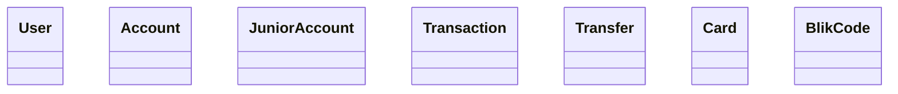
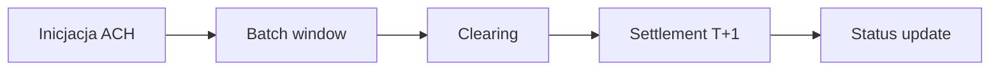
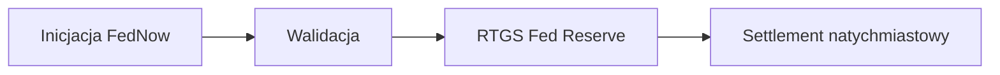
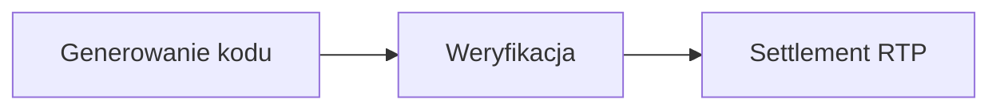
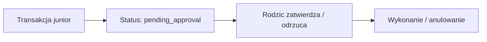

# US Bank System

Aplikacja webowa symulująca działanie amerykańskiego banku detalicznego. Projekt grupowy — moduł **Bank B (USA)**.

## Zakres

- Przelewy wewnętrzne między kontami
- ACH — standardowy przelew międzybankowy (rozliczenie T+1)
- RTP — natychmiastowy przelew konsumencki (real-time, 24/7)
- FedNow — przelew RTGS przez bank centralny
- SWIFT — przelew międzynarodowy
- Karty płatnicze (integracja) — transakcje tylko w USD
- BLIK — przelewy natychmiastowe (integracja)
- Konto junior (7-13 lat) — podpięte do konta rodzica, wszystkie transakcje wymagają zatwierdzenia przez rodzica, możliwość podpięcia karty prepaid z limitami

## Stack

| Warstwa | Technologia |
|---|---|
| Backend | C# ASP.NET Core 8 Web API |
| Frontend | React + Vite + TypeScript |
| Baza danych | PostgreSQL 16 |
| ORM | Entity Framework Core 8 |
| API Docs | Swagger / OpenAPI (Swashbuckle) |
| Auth | JWT Bearer Tokens |
| Konteneryzacja | Docker + Docker Compose |

---

## Wiedza domenowa

### ACH (Automated Clearing House)
> 📝 TODO (US-57) — opis mechanizmu, okna czasowe batch, rozliczenie T+1, rola NACHA

### RTP (Real-Time Payments)
> 📝 TODO (US-57) — opis mechanizmu, rozliczenie natychmiastowe 24/7, rola The Clearing House

### FedNow
> 📝 TODO (US-57) — opis mechanizmu RTGS, rola Fed Reserve, różnica vs RTP

### SWIFT
> 📝 TODO (US-57) — opis sieci korespondentów, IBAN, BIC, SWIFT gpi

### Karty płatnicze
> 📝 TODO (US-58) — opis autoryzacji, rozliczenia, rola issuera, acquirera, sieci kartowej

### BLIK
> 📝 TODO (US-58) — opis mechanizmu, kod 6-cyfrowy, settlement przez RTP

### Konto junior
> 📝 TODO (US-58) — opis mechanizmu zatwierdzania transakcji przez rodzica, karta prepaid, limity
 
---

## Diagramy

### Model domenowy (UML Class Diagram)

> 📝 TODO (US-52) — diagram klas: User, Account, JuniorAccount, Transaction, Transfer, Card, BlikCode
> Narzędzie: Mermaid lub draw.io



### Przepływ przelewu ACH (BPMN)

> 📝 TODO (US-53) — diagram przepływu: inicjacja → batch → clearing → settlement → status



### Przepływ przelewu FedNow (BPMN)

> 📝 TODO (US-53) — diagram przepływu: inicjacja → walidacja → RTGS → settlement natychmiastowy



### Przepływ BLIK (BPMN)

> 📝 TODO (US-54) — diagram przepływu: generowanie kodu → weryfikacja → settlement RTP



### Przepływ zatwierdzania transakcji junior (BPMN)

> 📝 TODO (US-54) — diagram przepływu: transakcja pending → powiadomienie rodzica → approve/reject


 
---

## Konfiguracja sesji płatności

Plik `src/UsBankSystem.Api/payment-config.json` pozwala konfigurować parametry czasowe systemów płatności. W środowisku deweloperskim skracasz wartości żeby testować integracje bez czekania na prawdziwe okna czasowe.

```json
{
  "PaymentSessions": {
    "Ach": {
      "BatchWindowMinutes": 1,
      "CutoffHour": 23
    },
    "FedNow": {
      "TimeoutSeconds": 10
    },
    "Rtp": {
      "TimeoutSeconds": 10
    },
    "Swift": {
      "TimeoutSeconds": 30
    }
  }
}
```

Wartości produkcyjne:
- ACH batch window: ~2-3h, cutoff: 17:00 ET
- FedNow timeout: 20s
- RTP timeout: 10s
- SWIFT: 1-5 dni roboczych
---

## Uruchomienie

### Wymagania

- [Docker Desktop](https://www.docker.com/products/docker-desktop/) (lub Docker Engine + Compose plugin)
- [Git](https://git-scm.com/)

### Krok 1 — Klonowanie repo

```bash
git clone https://github.com/g0rzki/us-bank-system.git
cd us-bank-system
```

### Krok 2 — Konfiguracja zmiennych środowiskowych

Skopiuj szablon i uzupełnij swoimi danymi:

```bash
cp .env.example .env
```

Otwórz `.env` i uzupełnij:

```env
POSTGRES_DB=usbank          # nazwa bazy — zostaw bez zmian
POSTGRES_USER=twoj_user     # dowolna nazwa użytkownika bazy
POSTGRES_PASSWORD=twoje_haslo
POSTGRES_PORT=5433          # port na hoście (5433 jeśli lokalny postgres zajmuje 5432)
JWT_SECRET=min_32_znaki     # dowolny ciąg min. 32 znaków
INTEGRATIONS_ACH_URL=http://localhost:6001
INTEGRATIONS_RTP_URL=http://localhost:6002
INTEGRATIONS_FEDNOW_URL=http://localhost:6003
INTEGRATIONS_SWIFT_URL=http://localhost:6004
INTEGRATIONS_CARDS_URL=http://localhost:6005
INTEGRATIONS_BLIK_URL=http://localhost:6006
```

> Plik `.env` jest wykluczony z gita — nie commituj go.

### Krok 3 — Konfiguracja Ridera

Skopiuj szablon `launchSettings.json`:

```bash
cp src/UsBankSystem.Api/Properties/launchSettings.template.json src/UsBankSystem.Api/Properties/launchSettings.json
```

Otwórz `launchSettings.json` i uzupełnij wartości w profilu `http` danymi z `.env`:

```json
"ConnectionStrings__Default": "Host=localhost;Port=5433;Database=usbank;Username=POSTGRES_USER;Password=POSTGRES_PASSWORD",
"Jwt__Secret": "JWT_SECRET"
```

> Plik `launchSettings.json` jest wykluczony z gita — nie commituj go.

### Krok 4 — Uruchomienie

```bash
docker compose up --build
```

Pierwsze uruchomienie pobiera obrazy i buduje kontenery — może potrwać kilka minut.

Aplikacja dostępna pod:

| Serwis | URL |
|---|---|
| Frontend | http://localhost:3000 |
| API | http://localhost:5000 |
| Swagger UI | http://localhost:5000/swagger |
| Health check | http://localhost:5000/health |

### Zatrzymanie aplikacji

```bash
docker compose down
```

Aby usunąć również dane z bazy (wolumen PostgreSQL):

```bash
docker compose down -v
```

---

## Struktura projektu

```
us-bank-system/
├── src/
│   ├── UsBankSystem.Api/             # ASP.NET Core Web API
│   │   └── payment-config.json       # konfiguracja sesji płatności
│   ├── UsBankSystem.Core/            # Domain entities, interfaces
│   └── UsBankSystem.Infrastructure/  # EF Core, repositories
├── frontend/                         # React + Vite SPA
├── docker-compose.yaml
├── .env.example
└── README.md
```

---

## API

Pełna dokumentacja dostępna przez Swagger UI pod `/swagger` po uruchomieniu aplikacji.

Główne endpointy:

| Metoda | Endpoint | Opis |
|---|---|---|
| POST | /auth/register | Rejestracja użytkownika |
| POST | /auth/login | Logowanie, zwraca JWT |
| GET | /accounts/{id} | Dane konta |
| GET | /accounts/{id}/balance | Saldo |
| GET | /accounts/{id}/transactions | Historia transakcji z paginacją |
| POST | /accounts | Tworzenie konta checking/savings |
| POST | /accounts/junior | Tworzenie konta junior (wymaga parent_account_id) |
| GET | /accounts/{id}/junior-accounts | Lista kont junior (widok rodzica) |
| GET | /accounts/{id}/junior-details | Szczegóły konta junior |
| PATCH | /accounts/{id}/junior-limit | Zmiana limitu karty prepaid przez rodzica |
| GET | /transfers/pending-approval | Lista transakcji czekających na zatwierdzenie (rodzic) |
| POST | /transfers/{id}/approve | Zatwierdzenie transakcji junior przez rodzica |
| POST | /transfers/{id}/reject | Odrzucenie transakcji junior przez rodzica |
| POST | /transfers/internal | Przelew wewnętrzny |
| POST | /transfers/ach | Przelew ACH (T+1) |
| POST | /transfers/rtp | Przelew RTP (real-time) |
| POST | /transfers/fednow | Przelew FedNow (RTGS) |
| POST | /transfers/swift | Przelew SWIFT |
| GET | /transfers/{id}/status | Status przelewu |
| GET | /accounts/{id}/cards | Lista kart konta |
| POST | /cards/register | Rejestracja karty |
| POST | /cards/authorize | Webhook autoryzacji kartowej |
| POST | /blik/generate | Generowanie kodu BLIK |
| POST | /blik/verify | Weryfikacja kodu BLIK |

---

## Integracje zewnętrzne

Projekt integruje się z modułami tworzonymi przez inne grupy. Adresy konfigurowane przez zmienne środowiskowe w `.env`:

```
INTEGRATIONS_ACH_URL=http://ach-module
INTEGRATIONS_RTP_URL=http://rtp-module
INTEGRATIONS_FEDNOW_URL=http://fednow-module
INTEGRATIONS_SWIFT_URL=http://swift-module
INTEGRATIONS_CARDS_URL=http://cards-module
INTEGRATIONS_BLIK_URL=http://blik-module
```

W środowisku deweloperskim każda integracja działa przez lokalny mock stub. Zamiana na produkcyjny moduł = zmiana URL w `.env`.

---

## Migracje bazy danych

Projekt używa Entity Framework Core do zarządzania schematem bazy danych.

### Tworzenie nowej migracji

```bash
dotnet ef migrations add NazwaMigracji -p src/UsBankSystem.Infrastructure -s src/UsBankSystem.Api
```

### Aplikowanie migracji do bazy

```bash
dotnet ef database update -p src/UsBankSystem.Infrastructure -s src/UsBankSystem.Api --connection "Host=localhost;Port=5433;Database=usbank;Username=POSTGRES_USER;Password=POSTGRES_PASSWORD"
```

---

## Workflow Git

- Gałąź `main` — każda zmiana przez PR z 1 approvem drugiego członka zespołu
- Gałąź `develop` - integracje z zewnętrznymi modułami innych grup
- Feature branche: `feature/US-XX-krotki-opis`, tworzone od `main`
- Commity mergowane przez **Squash and merge**
- Nie merguj własnego PR bez review drugiej osoby

### Format commitów

```
Feat: krótki opis       # nowa funkcjonalność
Fix: krótki opis        # naprawa błędu
Docs: krótki opis       # dokumentacja
Refactor: krótki opis   # refaktor bez zmiany funkcjonalności
```

### Tworzenie feature brancha

```bash
git checkout main
git pull
git checkout -b feature/US-XX-krotki-opis
```

---

## Dokumentacja

- [Backlog — Trello](https://trello.com/b/SoYXGs0x/tablica-projektowa)
- [Swagger UI](http://localhost:5000/swagger) — po uruchomieniu aplikacji

---

## Zespół

| Osoba | Zakres                                                |
|---|-------------------------------------------------------|
| [Piotr Gorzkiewicz](https://github.com/g0rzki) | Backend core, przelewy zewnętrzne, konto junior, BLIK |
| [Jakub Siłka](https://github.com/jakub7038) | Auth, frontend, karty, SWIFT                          |
