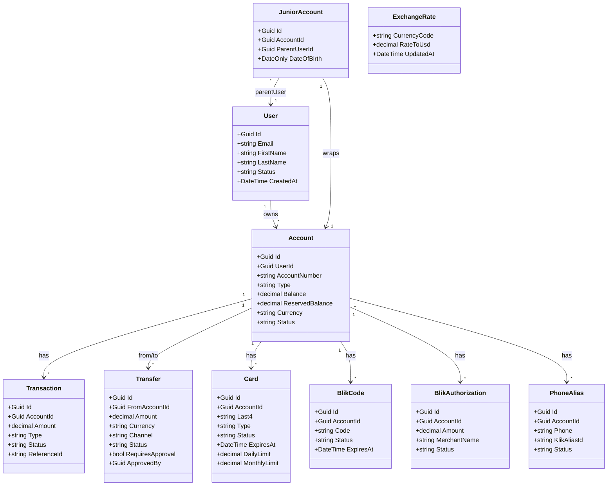
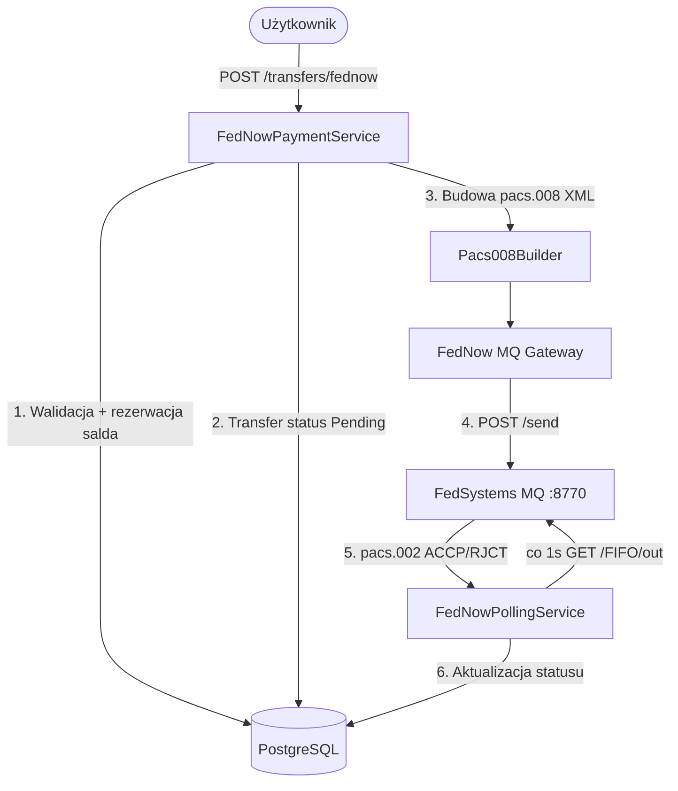
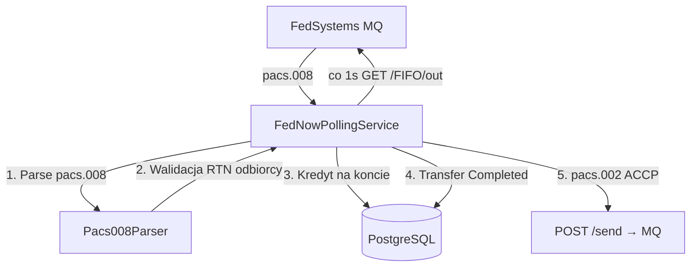
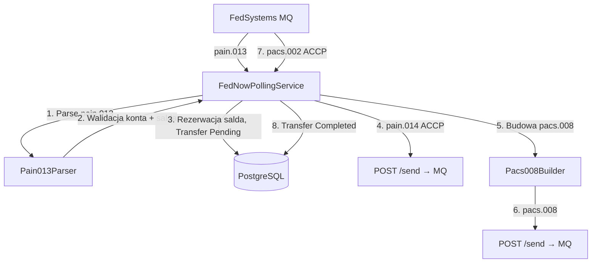
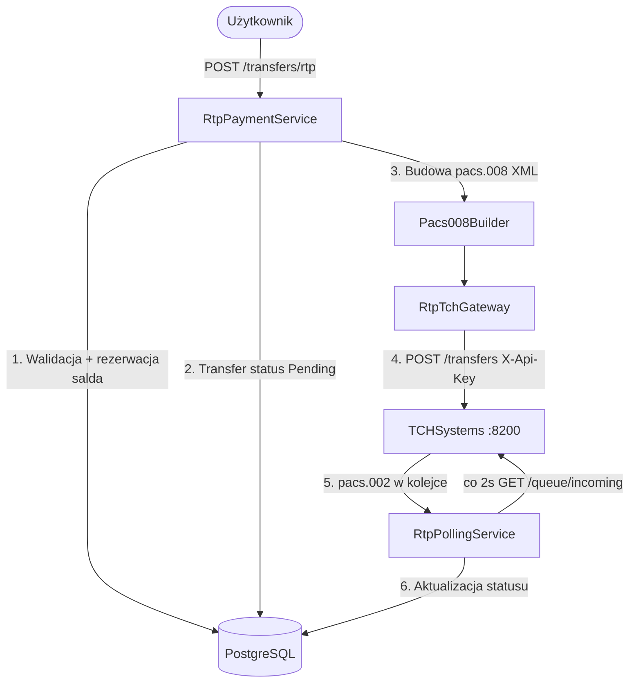
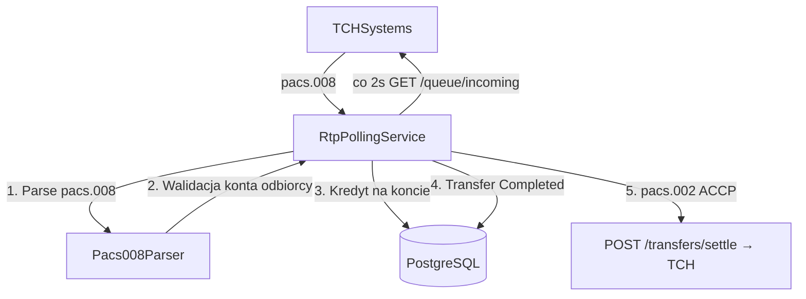
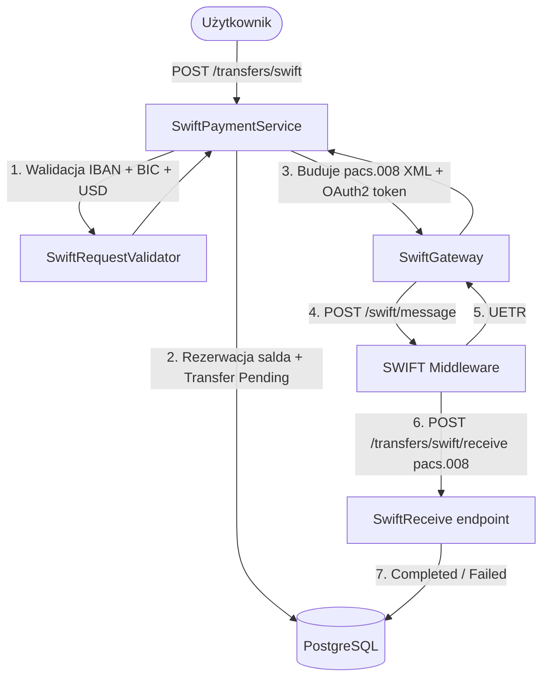
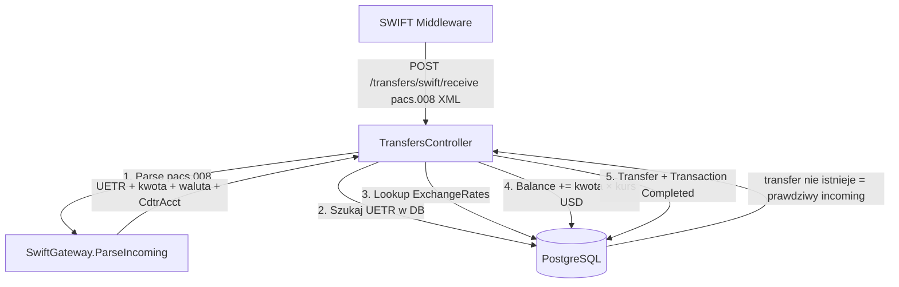
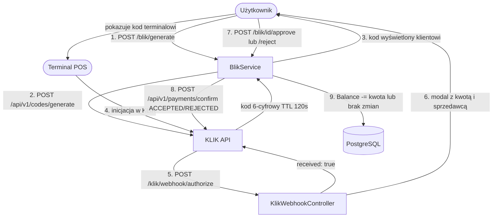
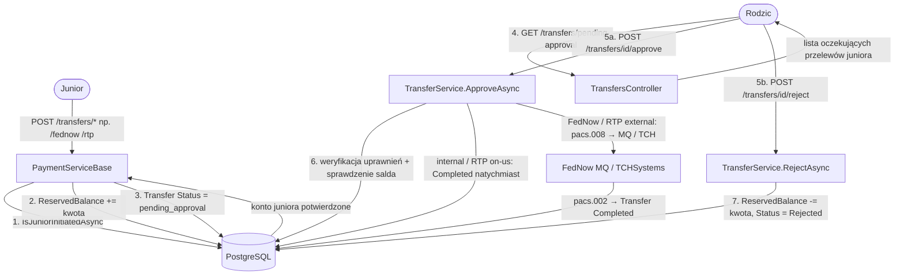

# US Bank System

Aplikacja webowa symulująca działanie amerykańskiego banku detalicznego. Projekt grupowy — moduł **Bank B (USA)**.

## Zakres

- Przelewy wewnętrzne między kontami
- ACH — standardowy przelew międzybankowy (rozliczenie T+1)
- RTP — natychmiastowy przelew konsumencki (real-time, 24/7)
- FedNow — przelew RTGS przez bank centralny
- SWIFT — przelew międzynarodowy
- Karty płatnicze (integracja) — transakcje tylko w USD
- BLIK — płatności kodem i przelewy na numer telefonu (integracja KLIK)
- Konto junior (7-13 lat) — podpięte do konta rodzica, wszystkie transakcje wymagają zatwierdzenia przez rodzica, możliwość podpięcia karty prepaid z limitami

## Stack

| Warstwa | Technologia |
|---|---|
| Backend | C# ASP.NET Core 8 Web API |
| Frontend | React + Vite + TypeScript |
| Baza danych | PostgreSQL 16 |
| ORM | Entity Framework Core 8 |
| API Docs | Swagger / OpenAPI (Swashbuckle) |
| Auth | JWT Bearer Tokens |
| Konteneryzacja | Docker + Docker Compose |

---

## Spis treści

- [Krok 0 — systemy siostrzane](#krok-0--systemy-siostrzane)
- [Tabela konfiguracji](#tabela-konfiguracji)
- [Wiedza domenowa](#wiedza-domenowa)
  - [ACH](#ach-automated-clearing-house)
  - [RTP](#rtp-real-time-payments)
  - [FedNow](#fednow-rtgs-via-fedsystems)
  - [SWIFT](#swift)
  - [Karty płatnicze](#karty-płatnicze)
  - [BLIK (integracja KLIK)](#blik-integracja-klik)
  - [Konto junior](#konto-junior)
- [Diagramy](#diagramy)
- [Konfiguracja sesji płatności](#konfiguracja-sesji-płatności)
- [Uruchomienie](#uruchomienie)
- [Struktura projektu](#struktura-projektu)
- [API](#api)
- [Integracje zewnętrzne](#integracje-zewnętrzne)
- [Integracja z Karty-Platnicze](#integracja-z-karty-platnicze)
- [Testy](#testy)
- [Migracje bazy danych](#migracje-bazy-danych)
- [Workflow Git](#workflow-git)

---

## Krok 0 — systemy siostrzane

Us-bank-system integruje się z czterema zewnętrznymi repozytoriami. Przed uruchomieniem `docker compose up` sklonuj je jako katalogi siostrzane (obok `us-bank-system/`) i uruchom w podanej kolejności:

| Repo | Odpowiedzialny | Wymagany przez |
|---|---|---|
| `Karty-Platnicze-Aplikacje-Biznesowe` | Filip | Karty płatnicze |
| `KLIK-payments` | MarshallBjorn | BLIK C2B, BLIK P2P |
| `payment-settlement-systems` (FedSystems + TCHSystems) | VanillaMile | ACH, FedNow, RTP |
| `SWIFT-Aplikacje-Biznesowe` | Jkwasnyy | SWIFT |

```bash
# FedSystems (ACH + FedNow)
cd ../payment-settlement-systems/FedSystems && docker compose up -d

# TCHSystems (RTP)
cd ../payment-settlement-systems/TCHSystems && docker compose up -d

# SWIFT Middleware
cd ../SWIFT-Aplikacje-Biznesowe && docker compose up -d
```

> **Sieci Docker:** `docker compose up` w tym repo padnie z błędem, jeśli zewnętrzne sieci `clearing-us-a-karty` lub `target_klik` jeszcze nie istnieją — tworzą je odpowiednio Karty-Platnicze i KLIK-payments przy swoim pierwszym uruchomieniu. Uruchom je przed tym repo.

Pełna lista portów systemów siostrzanych → [Tabela konfiguracji](#tabela-konfiguracji).

---

## Tabela konfiguracji

**Tożsamość banku** (wartości domyślne deweloperskie; zmienne konfigurowane przez `.env`):

| Parametr | Wartość | Zmienne `.env` |
|---|---|---|
| RTN banku | `040104018` | `FedNow__BankRtn`, `Rtp__BankRtn`, `Ach__RoutingNumber` |
| BIC (SWIFT) | `USBKUS01XXX` | `Swift__Bic` |
| Nazwa prawna | `Baguette Bank` | `FedNow__BankLegalName`, `Rtp__BankLegalName`, `Ach__LegalName` |
| RTN Fed Reserve Bank | `090000515` | `Ach__FrbRoutingNumber` |
| Bank routing (BLIK P2P on-us) | `021000021` | `Bank__RoutingNumber` |

**Porty systemów siostrzanych** (z hosta, nie Docker-wewnętrzne):

| System | URL | Zmienna `.env` |
|---|---|---|
| FedSystems ACH Helper | `http://localhost:8310` | `FEDSYSTEMS_ACH_URL` |
| FedSystems SFTP | `localhost:2221` | `Ach__Sftp__Port=2221` |
| FedSystems FedNow MQ | `http://localhost:8770` | `INTEGRATIONS_FEDNOW_MQ_URL` |
| FedSystems FedNow Central | `http://localhost:8514` | `FEDNOW_CENTRAL_URL` |
| TCHSystems RTP | `http://localhost:8200` | `INTEGRATIONS_RTP_TCH_URL` |
| SWIFT Middleware | `http://localhost:3000` | `INTEGRATIONS_SWIFT_URL` |
| Payment Gateway (Karty) | `http://localhost:8072` | `INTEGRATIONS_CARDS_URL_HOST` |
| KLIK (real) | `http://localhost:8000` | `KLIK_URL` |

Pełna lista zmiennych z komentarzami → `.env.example`.

---

## Wiedza domenowa

### ACH (Automated Clearing House)

**Status:** zweryfikowane end-to-end na żywo

**Opis:** ACH to sieć rozliczeniowa obsługiwana przez **NACHA** (National Automated Clearing House Association). Bank formuje plik NACHA (fixed-width, 94-znakowe rekordy) z transakcjami PPD i wysyła przez SFTP do **FedSystems** (`payment-settlement-systems/FedSystems`). Rozliczenie następuje następnego dnia roboczego (T+1).

**Przepływ:** Bank → plik NACHA uploadowany przez SFTP do `inbound/` → FedSystems przetwarza i umieszcza `.ack` w `outbound/` → polling co 60s → finalizacja statusu. Przychodzące od innych banków jako `processed_*.ach` w `outbound/`. Szczegółowy diagram → [Przepływ przelewu ACH (BPMN)](#przepływ-przelewu-ach-bpmn).

**Kluczowe pliki:**
- `src/UsBankSystem.Api/Services/Payments/AchPaymentService.cs`
- `src/UsBankSystem.Api/Integrations/AchGateway.cs`
- `src/UsBankSystem.Api/Services/Polling/AchPollingService.cs`

**Konfiguracja:**

| Zmienna | Opis | Przykład |
|---|---|---|
| `Ach__Sftp__Host` | Host SFTP FedSystems | `host.docker.internal` |
| `Ach__Sftp__Port` | Port SFTP | `2221` |
| `Ach__Sftp__Username` | Nazwa użytkownika SFTP | `baguette-bank` |
| `Ach__Sftp__PrivateKeyPath` | Ścieżka klucza prywatnego w kontenerze | `/app/sftp_keys/id_rsa` |
| `Ach__Sftp__AllowUncheckedFingerprint` | Pomija weryfikację SHA256 hosta (dev) | `true` |
| `Ach__PollIntervalSeconds` | Interwał pollingu `outbound/` | `60` |
| `Ach__CompanyId` | Company ID w nagłówku NACHA batch | `123456789` |

RTN banku, nazwa i RTN Fed Reserve → [Tabela konfiguracji](#tabela-konfiguracji).

**Kody transakcji NACHA:**
| Kod | Typ konta | Opis |
|---|---|---|
| `22` | Checking | Credit (wpływ na konto rozliczeniowe) |
| `32` | Savings | Credit (wpływ na konto oszczędnościowe) |

**Identyfikatory:**
- `trace_number`: `{RTN[..8]}{seq:D7}` — unikalny w skali dnia, generowany z DB-backed counter
- **Limit dzienny:** NACHA pozwala na max **36 plików dziennie** (`file_id_modifier`: A–Z, następnie 0–9)

**Ograniczenia:**
- `.ack` od FedSystems potwierdza tylko poprawność formatu pliku — nie jest to potwierdzenie rozliczenia. Faktyczne rozliczenie następuje po ~3 dniach roboczych bez oddzielnego callbacku. Aktualnie pozytywny `.ack` oznacza transfer jako `Completed`.
- Prenoty (kody NACHA `23`/`33`) są pomijane — FedSystems może je wysyłać jako weryfikację konta. Aktualnie lądują jako niezidentyfikowane linie w logach.
- Debety przychodzące (`27`/`28`/`37`/`38`) logowane jako `LogWarning`, ale nie są księgowane.

**Jak przetestować:** `bash verify-ach-integration.sh` — sprawdza łączność SFTP z FedSystems, wymianę plików i ACH Helper. Read-only, nie tworzy przelewów.

---

### RTP (Real-Time Payments)

**Status:** zweryfikowane end-to-end na żywo

**Opis:** RTP to sieć przelewów natychmiastowych operowana przez **The Clearing House** (TCH) — credit push only, 24/7/365. Bank komunikuje się z **TCHSystems** (`payment-settlement-systems/TCHSystems`) przez REST API z payloadami ISO 20022 XML (pacs.008/pacs.002), uwierzytelniając się nagłówkiem `X-Api-Key`.

**Przepływ:** Wychodzący: pacs.008 → `POST /transfers` TCHSystems → polling pacs.002 `GET /queue/incoming` co 2s → `Completed`/`Rejected`. Przychodzący: polling kolejki → parse pacs.008 → kredyt na koncie → pacs.002 ACCP odesłany przez `POST /transfers/settle`. Szczegółowe diagramy → [Przepływ przelewu RTP (BPMN)](#przepływ-przelewu-rtp-bpmn).

**Kluczowe pliki:**
- `src/UsBankSystem.Api/Services/Payments/RtpPaymentService.cs`
- `src/UsBankSystem.Api/Integrations/Rtp/RtpTchGateway.cs`
- `src/UsBankSystem.Api/Services/Polling/RtpPollingService.cs`

**Konfiguracja:**

| Zmienna | Opis | Przykład |
|---|---|---|
| `INTEGRATIONS_RTP_TCH_URL` | URL TCHSystems (wewnątrz Docker) | `http://host.docker.internal:8200` |
| `Rtp__ApiKey` | Klucz API `X-Api-Key` — puste = auto-rejestracja przy starcie TCH | `` |

RTN banku (`040104018`), BankCode (`baguette-bank`), nazwa → [Tabela konfiguracji](#tabela-konfiguracji).

**Obsługiwane przepływy:**
- **Przelew wychodzący (external):** `POST /transfers/rtp` z `toRoutingNumber` → pacs.008 → TCH → pacs.002 → `Completed`/`Rejected`
- **Przelew wychodzący (internal):** bez `toRoutingNumber` → wewnętrzny przelew natychmiastowy
- **Przelew przychodzący:** polling kolejki → parse pacs.008 → kredyt → pacs.002 ACCP. Duplikaty (po `EndToEndId`) ignorowane.
- **RJCT przychodzącego:** konto odbiorcy nie istnieje lub jest nieaktywne → pacs.002 RJCT odesłany do TCH

**Ograniczenia:**
- Settlement natychmiastowy — `Completed` od razu po zaksięgowaniu, bez mechanizmu opóźnionego rozliczenia.
- Brak strategii backoff przy niedostępności TCH — polling kontynuuje z tym samym interwałem.

**Jak przetestować:** `bash verify-rtp-integration.sh` — sprawdza łączność z TCHSystems, waliduje `X-Api-Key` poprawny i celowo błędny. Read-only, nie tworzy przelewów.

---

### FedNow (RTGS via FedSystems)

**Status:** zweryfikowane end-to-end na żywo

**Opis:** FedNow to system przelewów RTGS (Real-Time Gross Settlement) operowany przez Federal Reserve. Rozliczenie bezpośrednio przez bank centralny. Bank komunikuje się z **FedSystems** (`payment-settlement-systems/FedSystems`) przez kolejkę komunikatów HTTP (MQ gateway), wysyłając i odbierając ISO 20022 XML na endpoint `/send` i odpytując `/FIFO/out` o przychodzące wiadomości.

**Przepływ:** Polling `/FIFO/out` co 1s. Wychodzący: pacs.008 → MQ → pacs.002 ACCP/RJCT → `Completed`/`Rejected`. Przychodzący (od innego banku): pacs.008 z MQ → kredyt → pacs.002 ACCP. Request-to-pay od KLIK: pain.013 → walidacja + rezerwacja → pain.014 ACCP + pacs.008 → finalizacja pacs.002. Szczegółowe diagramy → [Przepływ przelewu FedNow (BPMN)](#przepływ-przelewu-fednow-bpmn).

**Kluczowe pliki:**
- `src/UsBankSystem.Api/Services/Payments/FedNowPaymentService.cs`
- `src/UsBankSystem.Api/Integrations/FedNow/FedNowMqGateway.cs`
- `src/UsBankSystem.Api/Integrations/FedNow/Pacs008Builder.cs`
- `src/UsBankSystem.Api/Services/Polling/FedNowPollingService.cs`

**Konfiguracja:**

| Zmienna | Opis | Przykład |
|---|---|---|
| `INTEGRATIONS_FEDNOW_MQ_URL` | URL MQ gateway FedSystems (wewnątrz Docker) | `http://host.docker.internal:8770` |
| `FedNow__PollIntervalSeconds` | Interwał pollingu (domyślnie 1) | `1` |

RTN banku (`040104018`), nazwa (`Baguette Bank`) → [Tabela konfiguracji](#tabela-konfiguracji).

**Ograniczenia:**
- `CreditorBankName` zawsze `"Unknown Bank"` — brak lookupa RTN → nazwa w systemie.
- Brak opóźnionego rozliczenia — transfer przechodzi w `Completed` po pacs.002 ACCP.

**Jak przetestować:** `bash verify-fednow-integration.sh` — sprawdza łączność z MQ FedSystems, rejestrację banku w FedNow Central. Read-only, nie wysyła komunikatów.

---

### SWIFT

**Status:** zweryfikowane end-to-end na żywo

**Opis:** SWIFT (Society for Worldwide Interbank Financial Telecommunication) to globalna sieć komunikatów finansowych dla przelewów międzynarodowych. Każdy bank identyfikowany przez **BIC** (np. `USBKUS01XXX`), każdy przelew przez **UETR** (globalnie unikalny UUID). Sam SWIFT nie przenosi środków — rozliczenie przez łańcuch banków korespondentów (nostro/vostro). Bank komunikuje się z **SWIFT Middleware** (`SWIFT-Aplikacje-Biznesowe`) przez OAuth2 client_credentials + ISO 20022 pacs.008 XML.

**Przepływ:** Wychodzący: walidacja (IBAN + BIC) → rezerwacja salda → OAuth2 token → pacs.008 → Middleware → UETR → `Pending` → callback `POST /transfers/swift/receive` → `Completed`/`Failed`. Przychodzący: Middleware POST `/transfers/swift/receive` → parse pacs.008 → konwersja waluty → kredyt na koncie. Szczegółowe diagramy → [Przepływ przelewu SWIFT (BPMN)](#przepływ-przelewu-swift-bpmn).

**Kluczowe pliki:**
- `src/UsBankSystem.Api/Services/Payments/SwiftPaymentService.cs`
- `src/UsBankSystem.Api/Integrations/SwiftGateway.cs`
- `src/UsBankSystem.Api/Services/TransferService.cs` (metoda `ProcessSwiftReceiveAsync`)
- `src/UsBankSystem.Core/Domain/Swift/SwiftRequestValidator.cs`

**Konfiguracja:**

| Zmienna | Opis | Przykład |
|---|---|---|
| `INTEGRATIONS_SWIFT_URL` | URL SWIFT Middleware | `http://host.docker.internal:3000` |
| `Swift__ClientId` | ID klienta OAuth2 | `bank-usbkus01` |
| `Swift__ClientSecret` | Sekret OAuth2 | `secret-usbkus01` |
| `Swift__WebhookSecret` | Sekret nagłówka `X-SWIFT-Webhook-Secret` | `dev_swift_webhook_secret` |

BIC banku (`USBKUS01XXX`) → [Tabela konfiguracji](#tabela-konfiguracji).

**Koszty (charge bearer):**
| Kod | Nazwa | Opis |
|---|---|---|
| `SHA` | Shared | Nadawca płaci opłaty swojego banku, odbiorca — banków pośredniczących i docelowego |
| `OUR` | Our (Debt) | Nadawca pokrywa wszystkie opłaty — odbiorca dostaje pełną kwotę |
| `BEN` | Beneficiary (Cred) | Odbiorca pokrywa wszystkie opłaty — kwota zostaje pomniejszona |

**Waluty:**
- Wychodzące: wyłącznie USD
- Przychodzące: dowolna z 20 walut ISO 4217 (EUR, GBP, CHF, JPY, PLN, ...) — konwertowane na USD wg statycznej tabeli `ExchangeRates` w DB

**Limity:**
- Dzienny limit wychodzący: **$50 000 / konto** (konfigurowalny przez `Swift:DailyLimitPerAccount`)
- Przelew juniora przez SWIFT trafia do `pending_approval` i wymaga zatwierdzenia przez rodzica

**Ograniczenia:**
- Brak callbacku potwierdzającego faktyczne dotarcie środków — po przyjęciu przez Middleware transfer czeka w `Pending` do wywołania `/receive`. W środowisku mock webhook przychodzi automatycznie po ~kilku sekundach (`Swift:TimeoutSeconds` w `payment-config.json`).
- Kursy walut statyczne (tabela `ExchangeRates` seedowana przy starcie) — brak integracji z zewnętrznym źródłem kursów.

**Jak przetestować:** `bash verify-swift-integration.sh` — sprawdza OAuth2 token, wysłanie pacs.008, webhook z poprawnym i celowo błędnym sekretem.

---

### Karty płatnicze

**Status:** zweryfikowane end-to-end na żywo

**Opis:** Integracja z **Karty-Platnicze-Aplikacje-Biznesowe** (payment-gateway + card-provider). Obsługuje karty debitowe (saldo konta bankowego) i prepaid (osobne saldo w payment-gateway). Rejestracja kart podpisywana HMAC-SHA256.

**Typy kart:**
- **Debit** — podpięta do konta bankowego, rejestrowana jako `VIRTUAL` w payment-gateway, auto-aktywuje się w ciągu ~60s
- **Prepaid** — własne saldo w payment-gateway; bank automatycznie przeprowadza kartę przez lifecycle (`REQUESTED → PRODUCING → SHIPPED → ACTIVE`)

**Przepływ:** Rejestracja karty (`POST /accounts/{id}/cards`) → HMAC-SHA256 → payment-gateway → token + masked PAN. Płatność: terminal POS autoryzuje w payment-gateway → card-provider settlement `POST /capture` do banku → bank księguje transakcję. Szczegółowy diagram → [Przepływ karty płatniczej (BPMN)](#przepływ-karty-płatniczej-bpmn).

**Kluczowe pliki:**
- `src/UsBankSystem.Api/Services/CardService.cs`
- `src/UsBankSystem.Api/Integrations/CardsGateway.cs`
- `src/UsBankSystem.Api/Controllers/CaptureController.cs`

**Konfiguracja:**

| Zmienna | Opis | Przykład |
|---|---|---|
| `INTEGRATIONS_CARDS_URL` | URL payment-gateway wewnątrz Docker | `http://cards_gateway_app:8000` |
| `INTEGRATIONS_CARDS_URL_HOST` | URL z hosta (skrypty testowe) | `http://localhost:8072` |
| `CARDS_API_KEY` | Klucz API banku do wystawiania i blokowania kart | `bank-key-us-a` |
| `CARDS_HMAC_SECRET` | Sekret HMAC-SHA256 do podpisywania żądań | `secret-us-a-hmac` |
| `CARDS_ADMIN_KEY` | Klucz admina (lifecycle prepaid, full-pan w testach) | `admin-secret-key-2026` |

**Ograniczenia:**
- Jedno aktywne konto: max 1 aktywna karta debitowa i 1 aktywna prepaid
- Konto junior: wyłącznie prepaid (max 1 aktywna)
- Zablokowana karta: odblokowanie dopiero po 24h od zablokowania
- Topup: dostępny tylko dla kart prepaid w statusie `active`

**Jak przetestować:** `bash verify-cards-integration.sh` — przy pierwszym uruchomieniu tworzy testową kartę prepaid (kolejne wywołania: idempotentne 409).

---

### BLIK (integracja KLIK)

**Status:** zweryfikowane end-to-end na żywo (C2B: mock + real KLIK; P2P on-us i off-us przez FedNow)

**Opis:** Integracja z systemem **KLIK** (akademicki klon BLIK). Bank działa jako klient API KLIK i wystawia webhook do odbioru autoryzacji płatności. W środowisku deweloperskim mock KLIK (port 6006) startuje automatycznie przez docker compose i obsługuje zarówno C2B jak i P2P.

#### C2B — płatność kodem

Klient generuje 6-cyfrowy kod BLIK i pokazuje go kasjerowi lub terminalowi. KLIK zarządza kodem i przesyła autoryzację do banku przez webhook.

**Przepływ:** Generowanie kodu (`BlikService` → KLIK `POST /api/v1/codes/generate`, TTL 120s) → terminal inicjuje w KLIK → webhook `POST /klik/webhook/authorize` do banku → `{received: true}` + modal u użytkownika → zatwierdzenie/odrzucenie → `POST /api/v1/payments/confirm` + debit konta. Diagram → [Przepływ KLIK C2B (BPMN)](#przepływ-klik-c2b-bpmn).

**Kluczowe pliki:**
- `src/UsBankSystem.Api/Services/BlikService.cs`
- `src/UsBankSystem.Api/Integrations/KlikApiClient.cs`
- `src/UsBankSystem.Api/Controllers/BlikController.cs`
- `src/UsBankSystem.Api/Controllers/KlikWebhookController.cs`

Rozliczenie międzybankowe (fee: 1% KLIK + 0.5% terminal) przeprowadza KLIK — bank obciąża wyłącznie konto klienta.

#### P2P on-us — odbiorca w tym samym banku

Klient rejestruje numer telefonu jako alias konta w KLIK. Przelew natychmiastowy przez lookup aliasu + porównanie routing number z własnym RTN banku.

**Przepływ:** `POST /transfers/p2p` → lookup aliasu KLIK → routing number = nasz RTN → debit nadawcy + credit odbiorcy → `Completed` natychmiast. Diagram → [Przepływ BLIK P2P on-us (BPMN)](#przepływ-blik-p2p-on-us-bpmn).

**Kluczowe pliki (P2P):**
- `src/UsBankSystem.Api/Services/PhoneAliasService.cs`
- `src/UsBankSystem.Api/Integrations/KlikP2pClient.cs`
- `src/UsBankSystem.Api/Controllers/P2pController.cs`

#### P2P off-us — odbiorca w innym banku

Przelew asynchroniczny przez FedNow (pacs.008) po uzyskaniu routing number innego banku z lookupu KLIK.

**Przepływ:** lookup KLIK → routing ≠ nasz → rezerwacja salda → pacs.008 przez FedNow MQ → pacs.002 ACCP/RJCT → `Completed`/`Rejected`. Wymaga aktywnej integracji FedNow. Diagram → [Przepływ BLIK P2P off-us przez FedNow (BPMN)](#przepływ-blik-p2p-off-us-przez-fednow-bpmn).

Scenariusz zweryfikowany end-to-end z Leek Bank (RTN `010101012`) zarejestrowanym w instancji KLIK.

**Konfiguracja:**

| Zmienna | Opis | Przykład |
|---|---|---|
| `INTEGRATIONS_BLIK_URL` | URL KLIK wewnątrz Docker | `http://web:8000` |
| `INTEGRATIONS_KLIK_API_KEY` | Klucz API KLIK | `klik_Aq79cfvR7OOtE9YORfuNMLJhjFCFe-BZL8nIUnQQoS4` |
| `KLIK_WEBHOOK_SECRET` | Sekret nagłówka `X-Webhook-Secret` | `changeme_klik_webhook_secret` |
| `KLIK_ALLOW_UNSIGNED_WEBHOOKS` | Akceptuj webhooki bez podpisu (dev) | `true` |

**Wymagania P2P:**
- Aktywna integracja FedNow (patrz sekcja [FedNow](#fednow-rtgs-via-fedsystems))
- `p2p_enabled=True` dla naszego banku w panelu administracyjnym KLIK

**Ograniczenia:**
- Konto junior: brak dostępu do BLIK i P2P
- Jedno aktywne konto: max 1 aktywny alias telefoniczny
- Numer telefonu: format E.164 dla US (`+1` + 10 cyfr, np. `+15551234567`)

**Jak przetestować:** `bash verify-blik-integration.sh` — health check KLIK, walidacja API key, dostępność webhooka `/klik/webhook/ping`. Read-only.

---

### Konto junior

**Status:** zweryfikowane end-to-end na żywo

**Opis:** Konto powiązane z kontem rodzica dla dzieci w wieku 7–13 lat. Każda transakcja inicjowana przez juniora trafia do statusu `pending_approval` i wymaga zatwierdzenia przez rodzica przed wykonaniem.

**Przepływ:** Junior inicjuje przelew → `PaymentServiceBase.IsJuniorInitiatedAsync()` → `RequiresApproval = true`, `Status = pending_approval`, `ReservedBalance += amount`. Rodzic pobiera listę (`GET /transfers/pending-approval`) → zatwierdza lub odrzuca. Zatwierdzone przelewy wewnętrzne i RTP on-us wykonywane natychmiast; FedNow i RTP external — pacs.008 wysłany do systemu rozliczeniowego. ACH zewnętrzny nie może być zatwierdzony przez ten flow — rodzic musi wysłać przelew samodzielnie. Diagram → [Zatwierdzanie transakcji junior (BPMN)](#zatwierdzanie-transakcji-junior-bpmn).

**Kluczowe pliki:**
- `src/UsBankSystem.Api/Services/JuniorService.cs`
- `src/UsBankSystem.Api/Services/TransferService.cs` (metody `ApproveAsync`, `RejectAsync`)
- `src/UsBankSystem.Core/Entities/JuniorAccount.cs`

**Ograniczenia:**
- Junior może mieć jedną kartę prepaid z limitem dziennym i miesięcznym ustawianym przez rodzica
- Topup karty juniora wykonuje rodzic
- BLIK i P2P niedostępne dla konta junior
- ACH zewnętrzny juniora nie przechodzi przez flow zatwierdzania — rodzic musi wysłać bezpośrednio

---

## Diagramy

### Model domenowy (UML Class Diagram)


```mermaid
classDiagram
    class User {
        +Guid Id
        +string Email
        +string FirstName
        +string LastName
        +string Status
        +DateTime CreatedAt
    }
    class Account {
        +Guid Id
        +Guid UserId
        +string AccountNumber
        +string Type
        +decimal Balance
        +decimal ReservedBalance
        +string Currency
        +string Status
    }
    class JuniorAccount {
        +Guid Id
        +Guid AccountId
        +Guid ParentUserId
        +DateOnly DateOfBirth
    }
    class Transaction {
        +Guid Id
        +Guid AccountId
        +decimal Amount
        +string Type
        +string Status
        +string ReferenceId
    }
    class Transfer {
        +Guid Id
        +Guid FromAccountId
        +decimal Amount
        +string Currency
        +string Channel
        +string Status
        +bool RequiresApproval
        +Guid ApprovedBy
    }
    class Card {
        +Guid Id
        +Guid AccountId
        +string Last4
        +string Type
        +string Status
        +DateTime ExpiresAt
        +decimal DailyLimit
        +decimal MonthlyLimit
    }
    class BlikCode {
        +Guid Id
        +Guid AccountId
        +string Code
        +string Status
        +DateTime ExpiresAt
    }
    class BlikAuthorization {
        +Guid Id
        +Guid AccountId
        +decimal Amount
        +string MerchantName
        +string Status
    }
    class PhoneAlias {
        +Guid Id
        +Guid AccountId
        +string Phone
        +string KlikAliasId
        +string Status
    }
    class ExchangeRate {
        +string CurrencyCode
        +decimal RateToUsd
        +DateTime UpdatedAt
    }

    User "1" --> "*" Account : owns
    Account "1" --> "*" Transaction : has
    Account "1" --> "*" Transfer : from/to
    Account "1" --> "*" Card : has
    Account "1" --> "*" BlikCode : has
    Account "1" --> "*" BlikAuthorization : has
    Account "1" --> "*" PhoneAlias : has
    JuniorAccount "1" --> "1" Account : wraps
    JuniorAccount "*" --> "1" User : parentUser
```

### Przepływ przelewu ACH (BPMN)


```mermaid
flowchart TD
    U([Użytkownik]) -->|POST /transfers/ach| API[AchPaymentService]
    API -->|1. Rezerwuje saldo| DB[(PostgreSQL)]
    API -->|2. Zapisuje transfer Pending| DB
    API -->|3. SendAsync| GW[AchGateway]
    GW -->|4. NextAsync — atomowy licznik| DB
    GW -->|5. POST /json-to-ach| HELPER[ACH Helper :8310]
    HELPER -->|NACHA bytes| GW
    GW -->|6. Upload inbound/YYYYMMDD_XXX.ach| SFTP[FedSystems SFTP :2221]
    SFTP -->|7. outbound/*.ack| POLL[AchPollingService]
    POLL -->|co 60s listuje outbound/| SFTP
    POLL -->|8. aktualizuje status| DB
    SFTP -->|processed_*.ach — incoming| POLL
    POLL -->|9. zapisuje incoming transfer| DB
```

**Legenda kroków:**
1. `AchPaymentService` blokuje saldo na koncie nadawcy (`ReservedBalance += amount`)
2. Transfer zapisywany z `Status = Pending`, `ExternalReferenceId = ComputeFileId(transferId)`
3. `AchGateway.SendAsync` wywoływany synchronicznie w tym samym flow
4. Atomowy counter w tabeli `AchDailyCounters` (`INSERT ... ON CONFLICT DO UPDATE RETURNING`)
5. JSON z detalami przelewu wysyłany do ACH Helper, który zwraca gotowe bajty NACHA
6. Plik NACHA uploadowany do FedSystems przez SFTP (SSH public-key auth)
7. Po przetworzeniu FedSystems umieszcza `.ack` w `outbound/` — polling sprawdza co 60s
8. Status transferu aktualizowany do `Completed` lub `Failed`, saldo debitowane lub zwalniane
9. Przelewy przychodzące (`processed_*.ach`) → nowe transakcje na koncie odbiorcy

### Przepływ przelewu FedNow (BPMN)

**Przelew wychodzący:**


```mermaid
flowchart TD
    U([Użytkownik]) -->|POST /transfers/fednow| SVC[FedNowPaymentService]
    SVC -->|1. Walidacja + rezerwacja salda| DB[(PostgreSQL)]
    SVC -->|2. Transfer status Pending| DB
    SVC -->|3. Budowa pacs.008 XML| B[Pacs008Builder]
    B --> MQ[FedNow MQ Gateway]
    MQ -->|4. POST /send| FS[FedSystems MQ :8770]
    FS -->|5. pacs.002 ACCP/RJCT| POLL[FedNowPollingService]
    POLL -->|co 1s GET /FIFO/out| FS
    POLL -->|6. Aktualizacja statusu| DB
```

**Przelew przychodzący (pacs.008 od innego banku):**


```mermaid
flowchart TD
    FS[FedSystems MQ] -->|pacs.008| POLL[FedNowPollingService]
    POLL -->|co 1s GET /FIFO/out| FS
    POLL -->|1. Parse pacs.008| P[Pacs008Parser]
    P -->|2. Walidacja RTN odbiorcy| POLL
    POLL -->|3. Kredyt na koncie| DB[(PostgreSQL)]
    POLL -->|4. Transfer Completed| DB
    POLL -->|5. pacs.002 ACCP| MQ[POST /send → MQ]
```

**Request-to-pay (pain.013 od KLIK):**


```mermaid
flowchart TD
    FS[FedSystems MQ] -->|pain.013| POLL[FedNowPollingService]
    POLL -->|1. Parse pain.013| P[Pain013Parser]
    P -->|2. Walidacja konta + salda| POLL
    POLL -->|3. Rezerwacja salda, Transfer Pending| DB[(PostgreSQL)]
    POLL -->|4. pain.014 ACCP| MQ1[POST /send → MQ]
    POLL -->|5. Budowa pacs.008| B[Pacs008Builder]
    B -->|6. pacs.008| MQ2[POST /send → MQ]
    FS -->|7. pacs.002 ACCP| POLL
    POLL -->|8. Transfer Completed| DB
```

### Przepływ przelewu RTP (BPMN)

**Przelew wychodzący:**


```mermaid
flowchart TD
    U([Użytkownik]) -->|POST /transfers/rtp| SVC[RtpPaymentService]
    SVC -->|1. Walidacja + rezerwacja salda| DB[(PostgreSQL)]
    SVC -->|2. Transfer status Pending| DB
    SVC -->|3. Budowa pacs.008 XML| B[Pacs008Builder]
    B --> GW[RtpTchGateway]
    GW -->|4. POST /transfers X-Api-Key| TCH[TCHSystems :8200]
    TCH -->|5. pacs.002 w kolejce| POLL[RtpPollingService]
    POLL -->|co 2s GET /queue/incoming| TCH
    POLL -->|6. Aktualizacja statusu| DB
```

**Legenda kroków:**
1. `RtpPaymentService` blokuje saldo na koncie nadawcy (`ReservedBalance += amount`)
2. Transfer zapisywany z `Status = Pending`, `ExternalReferenceId = E2E-{TransferId}`
3. `Pacs008Builder.Build()` tworzy komunikat ISO 20022 — `CdtrAgt/nm` ustawione na `ToBankCode` (identyfikator banku, nie RTN)
4. XML wysyłany do TCHSystems z uwierzytelnieniem `X-Api-Key` w nagłówku
5. TCH zwraca pacs.002 do kolejki przychodzących — polling co 2 sekundy
6. Status transferu aktualizowany: ACCP → `Completed` (saldo obciążone), RJCT → `Rejected` (rezerwacja zwolniona)

**Przelew przychodzący (pacs.008 od innego banku):**


```mermaid
flowchart TD
    TCH[TCHSystems] -->|pacs.008| POLL[RtpPollingService]
    POLL -->|co 2s GET /queue/incoming| TCH
    POLL -->|1. Parse pacs.008| P[Pacs008Parser]
    P -->|2. Walidacja konta odbiorcy| POLL
    POLL -->|3. Kredyt na koncie| DB[(PostgreSQL)]
    POLL -->|4. Transfer Completed| DB
    POLL -->|5. pacs.002 ACCP| GW[POST /transfers/settle → TCH]
```

**Legenda kroków:**
1. `Pacs008Parser.Parse()` wyciąga dane nadawcy, odbiorcy, kwotę, walutę i `EndToEndId`
2. Sprawdzenie duplikatu (`EndToEndId`), walidacja istnienia konta odbiorcy i statusu `active`
3. Saldo konta odbiorcy zwiększone o kwotę przelewu
4. Transfer zapisany z `Status = Completed`, transakcja typu `Credit` dodana do historii
5. `Pacs002Builder.Build()` tworzy odpowiedź ACCP (lub RJCT jeśli konto nie istnieje)

### Przepływ przelewu SWIFT (BPMN)

**Przelew wychodzący:**


```mermaid
flowchart TD
    U([Użytkownik]) -->|POST /transfers/swift| SVC[SwiftPaymentService]
    SVC -->|1. Walidacja IBAN + BIC + USD| VAL[SwiftRequestValidator]
    VAL --> SVC
    SVC -->|2. Rezerwacja salda + Transfer Pending| DB[(PostgreSQL)]
    SVC -->|3. Buduje pacs.008 XML + OAuth2 token| GW[SwiftGateway]
    GW -->|4. POST /swift/message| MW[SWIFT Middleware]
    MW -->|5. UETR| GW
    GW --> SVC
    MW -->|6. POST /transfers/swift/receive pacs.008| RCV[SwiftReceive endpoint]
    RCV -->|7. Completed / Failed| DB
```

**Legenda kroków:**
1. `SwiftRequestValidator.Validate()` — walidacja IBAN (checksum), BIC (format), waluta USD
2. `ReservedBalance += amount`, Transfer z `Status = Pending`
3. `SwiftGateway` uzyskuje OAuth2 token (client_credentials) i buduje pacs.008 z UETR (UUID)
4. XML wysłany do SWIFT Middleware `POST /swift/message`
5. Middleware zwraca UETR — unikalny identyfikator płatności w sieci SWIFT
6. Po rozliczeniu (lub odrzuceniu) Middleware wywołuje `/transfers/swift/receive` z pacs.008 lub pacs.008 RETURN
7. `TransferService.ProcessSwiftReceiveAsync`: `Completed` (saldo obciążone) lub `Failed` (rezerwacja zwolniona)

**Przelew przychodzący:**


```mermaid
flowchart TD
    MW[SWIFT Middleware] -->|POST /transfers/swift/receive pacs.008 XML| RCV[TransfersController]
    RCV -->|1. Parse pacs.008| PRS[SwiftGateway.ParseIncoming]
    PRS -->|UETR + kwota + waluta + CdtrAcct| RCV
    RCV -->|2. Szukaj UETR w DB| DB[(PostgreSQL)]
    DB -->|transfer nie istnieje = prawdziwy incoming| RCV
    RCV -->|3. Lookup ExchangeRates| DB
    RCV -->|4. Balance += kwota × kurs USD| DB
    RCV -->|5. Transfer + Transaction Completed| DB
```

**Legenda kroków:**
1. `SwiftGateway.ParseIncoming()` — wyciąga UETR, `IntrBkSttlmAmt[@Ccy]` (kwota + waluta), `CdtrAcct/Id/Othr/Id` (numer konta odbiorcy)
2. Idempotency: jeśli UETR już istnieje w DB — pominięcie (duplicate delivery)
3. Lookup kursu w tabeli `ExchangeRates` — obsługiwane: EUR, GBP, CHF, JPY, PLN i inne waluty ISO 4217
4. Konwersja: `amountUsd = round(amount × rateToUsd, 2)`, `Account.Balance += amountUsd`
5. Nowy Transfer (`Channel = swift`, `Status = Completed`) + Transaction (`Type = Credit`) zapisane w DB

### Przepływ karty płatniczej (BPMN)

**Wydanie karty i płatność (debit):**


```mermaid
flowchart TD
    U([Użytkownik]) -->|POST /accounts/id/cards| SVC[CardService]
    SVC -->|1. IssueCardAsync HMAC-SHA256| GW[Payment-Gateway]
    GW -->|token + masked PAN| SVC
    SVC -->|2. Zapis karty| DB[(PostgreSQL)]
    GW -->|3. Auto-aktywacja ~60s| GW
    POS([Terminal POS]) -->|4. Autoryzacja| GW
    GW -->|APPROVED / DECLINED| POS
    GW -->|5. POST /capture settlement| CAPT[CaptureController]
    CAPT -->|6. Balance -= amount| DB
    CAPT -->|7. Transakcja debit| DB
```

**Legenda kroków:**
1. `CardsGateway.IssueCardAsync()` — karta rejestrowana jako `VIRTUAL` w payment-gateway, żądanie podpisane HMAC-SHA256
2. Token karty (`tok_...`), zamaskowany PAN i data ważności zapisane w bazie
3. Karta debitowa aktywuje się automatycznie w payment-gateway w ciągu ~60 sekund
4. Terminal POS autoryzuje płatność bezpośrednio w payment-gateway — bank nie uczestniczy w autoryzacji
5. Card-provider wysyła settlement webhook `POST /capture` po max 30s (dev) / 24h (prod)
6. **Karta debit:** saldo konta bankowego pomniejszone o kwotę transakcji (`Account.Balance -= amount`)
7. Transakcja typu `debit` ze statusem `completed` zapisana w historii konta

**Płatność kartą prepaid — różnica:**


```mermaid
flowchart TD
    U([Użytkownik]) -->|POST /accounts/id/cards type=prepaid| SVC[CardService]
    SVC -->|1. IssueCardAsync PREPAID| GW[Payment-Gateway]
    SVC -->|2. Lifecycle REQUESTED→ACTIVE| GW
    U -->|3. POST topup| SVC
    SVC -->|4. Zasilenie salda prepaid| GW
    POS([Terminal POS]) -->|5. Autoryzacja z salda prepaid| GW
    GW -->|6. POST /capture| CAPT[CaptureController]
    CAPT -->|7. Transakcja w historii, saldo konta bez zmian| DB[(PostgreSQL)]
```

**Legenda kroków:**
1. Karta rejestrowana jako `PREPAID` w payment-gateway — saldo początkowe 0
2. `ActivatePrepaidInBackgroundAsync` przeprowadza kartę przez lifecycle: `REQUESTED → PRODUCING → SHIPPED → ACTIVE`
3. Rodzic (lub właściciel) zasila kartę prepaid przez `POST /accounts/{id}/cards/{cardId}/topup`
4. Środki trafiają na saldo karty w payment-gateway (nie na konto bankowe)
5. Autoryzacja płatności sprawdza saldo prepaid w payment-gateway — konto bankowe nie jest obciążane
6. Settlement webhook `POST /capture` po autoryzacji
7. **Karta prepaid:** transakcja zapisana w historii konta, ale `Account.Balance` **nie jest zmniejszane** — środki zostały już odjęte z salda prepaid w momencie autoryzacji

### Przepływ KLIK C2B (BPMN)


```mermaid
flowchart TD
    U([Użytkownik]) -->|1. POST /blik/generate| SVC[BlikService]
    SVC -->|2. POST /api/v1/codes/generate| KLIK[KLIK API]
    KLIK -->|kod 6-cyfrowy TTL 120s| SVC
    SVC -->|3. kod wyświetlony klientowi| U
    U -->|pokazuje kod terminalowi| POS([Terminal POS])
    POS -->|4. inicjacja w KLIK| KLIK
    KLIK -->|5. POST /klik/webhook/authorize| WH[KlikWebhookController]
    WH -->|received: true| KLIK
    WH -->|6. modal z kwotą i sprzedawcą| U
    U -->|7. POST /blik/id/approve lub /reject| SVC
    SVC -->|8. POST /api/v1/payments/confirm ACCEPTED/REJECTED| KLIK
    SVC -->|9. Balance -= kwota lub brak zmian| DB[(PostgreSQL)]
```

**Legenda kroków:**
1. `BlikService` wywołuje KLIK `POST /api/v1/codes/generate` z `accountId`
2. KLIK zwraca 6-cyfrowy kod ważny 120 sekund
3. Kod wyświetlany klientowi w aplikacji banku
4. Terminal skanuje kod i inicjuje transakcję w KLIK
5. KLIK wysyła webhook `POST /klik/webhook/authorize` z kwotą i `merchantName` — bank odpowiada `{received: true}`
6. Bank wyświetla modal potwierdzający z danymi transakcji
7. Klient zatwierdza (`approve`) lub odrzuca (`reject`)
8. `POST /api/v1/payments/confirm` z wynikiem ACCEPTED/REJECTED do KLIK
9. Przy ACCEPTED: `Account.Balance -= amount`, zapis transakcji. Fee: 1% KLIK + 0.5% terminal — potrącane przez KLIK, nie przez bank

### Przepływ BLIK P2P on-us (BPMN)


```mermaid
flowchart TD
    U([Użytkownik]) -->|POST /transfers/p2p| P2P[P2pController]
    P2P -->|1. Lookup aliasu| KLIK[KLIK API]
    KLIK -->|routing_number + account| P2P
    P2P -->|2. Routing number = nasz?| DEC{On-us?}
    DEC -->|Tak| INT[InternalPaymentService]
    INT -->|3. Debit nadawcy| DB[(PostgreSQL)]
    INT -->|4. Credit odbiorcy| DB
    INT -->|5. Transfer Completed natychmiast| DB
```

**Legenda kroków:**
1. `KlikP2pClient.LookupAliasAsync(phone)` — odpytanie KLIK o routing number i numer konta przypisany do numeru telefonu
2. Porównanie `lookup.RoutingNumber` z własnym RTN banku — jeśli się zgadza, przelew wewnętrzny
3. Saldo konta nadawcy pomniejszone o kwotę (`Balance -= amount`)
4. Saldo konta odbiorcy zwiększone o kwotę (`Balance += amount`)
5. Transfer zapisany ze statusem `Completed`, transakcje debit/credit dodane do historii — całość natychmiastowa

### Przepływ BLIK P2P off-us przez FedNow (BPMN)


```mermaid
flowchart TD
    U([Użytkownik]) -->|POST /transfers/p2p| P2P[P2pController]
    P2P -->|1. Lookup aliasu| KLIK[KLIK API]
    KLIK -->|routing_number ≠ nasz| P2P
    P2P -->|2. Rezerwacja salda| DB[(PostgreSQL)]
    P2P -->|3. Transfer Pending| DB
    P2P -->|4. Budowa pacs.008| B[Pacs008Builder]
    B -->|dane odbiorcy z KLIK| MQ[FedNow MQ Gateway]
    MQ -->|5. POST /send| FS[FedSystems MQ :8770]
    FS -->|6. pacs.002 ACCP/RJCT| POLL[FedNowPollingService]
    POLL -->|co 1s GET /FIFO/out| FS
    POLL -->|7. Aktualizacja statusu| DB
```

**Legenda kroków:**
1. `KlikP2pClient.LookupAliasAsync(phone)` — KLIK zwraca routing number i numer konta odbiorcy w innym banku
2. Saldo nadawcy zablokowane (`ReservedBalance += amount`)
3. Transfer zapisany ze statusem `Pending`
4. `Pacs008Builder.Build()` — komunikat ISO 20022 z danymi z lookupu KLIK: `CreditorBankRtn` = routing number, `CreditorAccountNumber` = numer konta. `CreditorBankName` ustawiane jako `"Unknown Bank"` (KLIK nie zwraca nazwy banku)
5. Komunikat wysłany do FedSystems MQ — FedSystems doręcza go do banku odbiorcy
6. Bank odbiorcy przetwarza przelew i odsyła pacs.002 (ACCP = przyjęty, RJCT = odrzucony)
7. ACCP → `Completed`, saldo finalnie obciążone; RJCT → `Rejected`, rezerwacja zwolniona

### Zatwierdzanie transakcji junior (BPMN)


```mermaid
flowchart TD
    J([Junior]) -->|POST /transfers/* np. /fednow /rtp| SVC[PaymentServiceBase]
    SVC -->|1. IsJuniorInitiatedAsync| DB[(PostgreSQL)]
    DB -->|konto juniora potwierdzone| SVC
    SVC -->|2. ReservedBalance += kwota| DB
    SVC -->|3. Transfer Status = pending_approval| DB
    P([Rodzic]) -->|4. GET /transfers/pending-approval| LIST[TransfersController]
    LIST -->|lista oczekujących przelewów juniora| P
    P -->|5a. POST /transfers/id/approve| APPR[TransferService.ApproveAsync]
    APPR -->|6. weryfikacja uprawnień + sprawdzenie salda| DB
    APPR -->|internal / RTP on-us: Completed natychmiast| DB
    APPR -->|FedNow / RTP external: pacs.008 → MQ / TCH| EXT[FedNow MQ / TCHSystems]
    EXT -->|pacs.002 → Transfer Completed| DB
    P -->|5b. POST /transfers/id/reject| REJ[TransferService.RejectAsync]
    REJ -->|7. ReservedBalance -= kwota, Status = Rejected| DB
```

**Legenda kroków:**
1. `PaymentServiceBase.IsJuniorInitiatedAsync()` — sprawdza czy konto należy do juniora w DB
2. Saldo zablokowane — `ReservedBalance += amount`
3. Transfer zapisany z `Status = pending_approval`, `RequiresApproval = true`
4. Rodzic pobiera listę oczekujących przelewów swojego juniora (filtr po `JuniorAccounts.ParentUserId`)
5a. `TransferService.ApproveAsync` — weryfikacja że rodzic jest właścicielem + sprawdzenie dostępnego salda
5b. `TransferService.RejectAsync` — weryfikacja uprawnień rodzica
6. Dla przelewów wewnętrznych i RTP on-us: natychmiastowe obciążenie/uznanie kont → `Completed`. Dla FedNow i RTP zewnętrznego: pacs.008 wysłany do systemu rozliczeniowego → `Pending` do czasu pacs.002
7. Odrzucenie: rezerwacja zwolniona, transfer odrzucony. **ACH zewnętrzny nie może przejść przez ten flow** — rodzic musi wysłać przelew samodzielnie przez `/transfers/ach`

---

## Konfiguracja sesji płatności

Plik `src/UsBankSystem.Api/payment-config.json` zawiera **parametry operacyjne** (timeouty, okna batch). Tożsamość banku (BankRtn, BankCode, BankLegalName) konfigurowana jest **wyłącznie przez zmienne środowiskowe** — domyślne wartości w kodzie C# (`PaymentSessionConfig.cs`) to `040104018` / `baguette-bank`.

```json
{
  "PaymentSessions": {
    "Ach": {
      "BatchWindowMinutes": 1,
      "CutoffHour": 23
    },
    "FedNow": {
      "TimeoutSeconds": 30,
      "PollIntervalSeconds": 1
    },
    "Rtp": {
      "TimeoutSeconds": 10
    },
    "Swift": {
      "TimeoutSeconds": 30
    }
  }
}
```

Wartości produkcyjne:
- ACH batch window: ~2-3h, cutoff: 17:00 ET
- FedNow timeout: 20s
- RTP timeout: 10s
- SWIFT: 1-5 dni roboczych

---

## Uruchomienie

### Wymagania

| System | Narzędzia |
|---|---|
| **macOS** | [Docker Desktop](https://www.docker.com/products/docker-desktop/) lub [Colima](https://github.com/abiosoft/colima) + Docker CLI + Compose plugin, [Git](https://git-scm.com/) |
| **Windows** | [Docker Desktop](https://www.docker.com/products/docker-desktop/), [Git for Windows](https://gitforwindows.org/) (zawiera Git Bash) |
| **Linux** | Docker Engine + [Compose plugin](https://docs.docker.com/compose/install/linux/), Git |

> **Windows:** Skrypty `.sh` (testy, verify-*) wymagają **Git Bash** lub **WSL2**. PowerShell nie obsługuje `source .env`. Projekt zawiera `.gitattributes` wymuszający LF w skryptach — `git clone` automatycznie zachowa poprawne zakończenia linii.

### Krok 1 — Klonowanie repo

```bash
git clone https://github.com/g0rzki/us-bank-system.git
cd us-bank-system
```

### Krok 2 — Konfiguracja zmiennych środowiskowych

```bash
cp .env.example .env          # macOS / Linux / Git Bash
# copy .env.example .env      # Windows CMD
```

Plik `.env.example` zawiera komentarze przy każdej zmiennej, pogrupowane sekcjami. Minimalne zmiany do uruchomienia:

```env
POSTGRES_PASSWORD=twoje_haslo          # dowolne — baza lokalna
JWT_SECRET=min_32_znaki_dowolny_ciag   # dowolny ciąg min. 32 znaków
```

Reszta ma sensowne domyślne wartości deweloperskie. Pełny opis zmiennych — patrz `.env.example`.

> `FRONTEND_PORT` kontroluje zarówno port frontendu w Docker jak i CORS w API — ustaw raz, działa wszędzie.

> Plik `.env` jest wykluczony z gita — nie commituj go.

### Krok 3 — Konfiguracja Ridera (opcjonalne)

Tylko jeśli uruchamiasz API bezpośrednio z IDE (bez Dockera):

```bash
cp src/UsBankSystem.Api/Properties/launchSettings.template.json src/UsBankSystem.Api/Properties/launchSettings.json
```

Uzupełnij wartości w profilu `http` danymi z `.env`:

```json
"ConnectionStrings__Default": "Host=localhost;Port=5999;Database=usbank;Username=POSTGRES_USER;Password=POSTGRES_PASSWORD",
"Jwt__Secret": "JWT_SECRET"
```

> Plik `launchSettings.json` jest wykluczony z gita.

### Krok 4 — Uruchomienie

```bash
docker compose up --build
```

Pierwsze uruchomienie pobiera obrazy i buduje kontenery — może potrwać kilka minut. Migracje bazy danych aplikują się automatycznie przy starcie.

> Mock gateway (ACH/RTP/FedNow/KLIK) startuje automatycznie jako osobny serwis.

**Force rebuild** (po zmianach w Dockerfile lub zależnościach):

```bash
docker compose build --no-cache && docker compose up
```

#### Serwisy dostępne po uruchomieniu

| Serwis | URL | Wymaga systemu siostrzanego? |
|---|---|---|
| Frontend | http://localhost:3100 | — |
| API | http://localhost:5100 | — |
| Swagger UI | http://localhost:5100/swagger | — |
| Health check | http://localhost:5100/health | — |
| Mock RTP | http://localhost:6002 | — |
| Mock FedNow | http://localhost:6003 | — |
| Mock KLIK C2B+P2P | http://localhost:6006 | — |

#### Serwisy wymagające uruchomienia projektów siostrzanych

| Serwis | URL z hosta | Projekt |
|---|---|---|
| ACH Helper (json-to-ach) | http://localhost:8310 | `payment-settlement-systems/FedSystems` |
| FedSystems SFTP | localhost:2221 | `payment-settlement-systems/FedSystems` |
| FedNow MQ | http://localhost:8770 | `payment-settlement-systems/FedSystems` |
| FedNow Central | http://localhost:8514 | `payment-settlement-systems/FedSystems` |
| TCHSystems RTP | http://localhost:8200 | `payment-settlement-systems/TCHSystems` |
| SWIFT Middleware | http://localhost:3000 | `SWIFT-Aplikacje-Biznesowe` |
| Payment Gateway (karty) | http://localhost:8072 | `Karty-Platnicze-Aplikacje-Biznesowe` |
| KLIK (real) | http://localhost:8000 | `KLIK-payments` |

> Po uruchomieniu us-bank-system razem z **Karty-Platnicze-Aplikacje-Biznesowe** wymagana jest dodatkowa konfiguracja sieci Docker — patrz sekcja [Integracja z Karty-Platnicze](#integracja-z-karty-platnicze).

### Zatrzymanie aplikacji

```bash
docker compose down
```

Aby usunąć również dane z bazy (wolumen PostgreSQL):

```bash
docker compose down -v
```

---

## Struktura projektu

```
us-bank-system/
├── src/
│   ├── UsBankSystem.Api/             # ASP.NET Core Web API
│   │   └── payment-config.json       # konfiguracja sesji płatności (timeouty, okna batch)
│   ├── UsBankSystem.Core/            # Domain entities, interfaces
│   ├── UsBankSystem.Infrastructure/  # EF Core, repositories
│   ├── UsBankSystem.MockGateways/    # Mock stuby ACH/RTP/FedNow/SWIFT/KLIK (porty 6001-6004, 6006)
│   ├── UsBankSystem.Tests/           # Testy API
│   └── UsBankSystem.MockGateways.Tests/ # Testy mock stubów
├── frontend/                         # React + Vite SPA
├── docker-compose.yaml
├── .env.example
└── README.md
```

---

## API

Pełna dokumentacja dostępna przez Swagger UI pod `/swagger` po uruchomieniu aplikacji.

### Auth

| Metoda | Endpoint | Opis |
|---|---|---|
| POST | /auth/register | Rejestracja użytkownika |
| POST | /auth/login | Logowanie, zwraca JWT (ważny 1h) |

### Konta

| Metoda | Endpoint | Opis |
|---|---|---|
| POST | /accounts | Tworzenie konta checking/savings |
| GET | /accounts | Lista kont zalogowanego użytkownika |
| GET | /accounts/{id} | Dane konta |
| GET | /accounts/{id}/balance | Saldo |
| GET | /accounts/{id}/transactions | Historia transakcji (paginacja: `?page=1&pageSize=20`) |
| POST | /accounts/junior | Tworzenie konta junior |
| GET | /accounts/{id}/junior-accounts | Lista kont junior podpiętych do konta rodzica |
| POST | /accounts/junior/{id}/card | Dodanie karty prepaid do konta junior (tylko rodzic) |
| PATCH | /accounts/{id}/junior-limit | Zmiana limitu karty prepaid juniora (tylko rodzic) |

### Przelewy

| Metoda | Endpoint | Opis |
|---|---|---|
| POST | /transfers/internal | Przelew wewnętrzny (natychmiastowy) |
| POST | /transfers/ach | Przelew ACH (T+1, batch) |
| POST | /transfers/rtp | Przelew RTP (real-time) |
| POST | /transfers/fednow | Przelew FedNow (RTGS) |
| POST | /transfers/swift | Przelew SWIFT (międzynarodowy) |
| GET | /transfers | Lista przelewów użytkownika |
| GET | /transfers/{id}/status | Status przelewu |
| GET | /transfers/pending-approval | Przelewy juniora czekające na zatwierdzenie |
| POST | /transfers/{id}/approve | Zatwierdzenie przelewu juniora przez rodzica |
| POST | /transfers/{id}/reject | Odrzucenie przelewu juniora przez rodzica |
| POST | /transfers/{id}/webhook | Webhook od mock gateway (zmiana statusu przelewu) |

### Karty

| Metoda | Endpoint | Opis |
|---|---|---|
| GET | /accounts/{id}/cards | Lista kart konta |
| POST | /accounts/{id}/cards | Rejestracja karty (`type: "debit"` lub `"prepaid"`) |
| GET | /accounts/{id}/cards/{cardId} | Szczegóły karty (synchronizuje status z payment-gateway) |
| PATCH | /accounts/{id}/cards/{cardId}/status | Zmiana statusu (`blocked` / `active`) |
| PATCH | /accounts/{id}/cards/{cardId}/limits | Ustawienie limitów dziennego/miesięcznego |
| POST | /accounts/{id}/cards/{cardId}/topup | Doładowanie karty prepaid |
| GET | /accounts/{id}/cards/{cardId}/external-status | Status karty w payment-gateway (saldo, limity) |
| POST | /capture | Webhook od card-provider po settlement transakcji kartowej |

### BLIK

| Metoda | Endpoint | Opis |
|---|---|---|
| POST | /blik/generate | Generowanie kodu BLIK (wywołuje KLIK API) |
| GET | /blik/pending | Lista oczekujących autoryzacji BLIK |
| POST | /blik/{id}/approve | Zatwierdź autoryzację (debit konta, potwierdź KLIK) |
| POST | /blik/{id}/reject | Odrzuć autoryzację BLIK |
| GET | /blik/transactions | Historia autoryzacji BLIK |
| POST | /klik/webhook/authorize | Webhook przychodzący z KLIK (autoryzacja płatności) |
| POST | /klik/webhook/ping | Webhook ping od KLIK (keepalive) |

### P2P (przelew na numer telefonu)

| Metoda | Endpoint | Opis |
|---|---|---|
| GET | /accounts/{id}/phone-alias | Odczyt aktywnego aliasu telefon→konto |
| POST | /accounts/{id}/phone-alias | Rejestracja aliasu telefonu w KLIK |
| DELETE | /accounts/{id}/phone-alias | Usunięcie aliasu |
| POST | /transfers/p2p | Przelew na numer telefonu (on-us lub przez FedNow) |

---

## Integracje zewnętrzne

Projekt integruje się z modułami tworzonymi przez inne grupy. Adresy konfigurowane przez zmienne środowiskowe w `.env` (pełna lista z komentarzami — patrz `.env.example`):

```
INTEGRATIONS_RTP_TCH_URL=http://host.docker.internal:8200   # TCHSystems RTP
INTEGRATIONS_FEDNOW_MQ_URL=http://host.docker.internal:8770 # FedSystems MQ
INTEGRATIONS_SWIFT_URL=http://host.docker.internal:3000      # SWIFT Middleware (real, nie mock 6004)
INTEGRATIONS_CARDS_URL=http://cards_gateway_app:8000          # Karty-Platnicze w sieci Docker
INTEGRATIONS_BLIK_URL=http://web:8000                         # KLIK w sieci Docker (mock: http://mock-gateways:6006)
INTEGRATIONS_KLIK_API_KEY=twoj_api_key                        # klucz API od operatora KLIK
KLIK_WEBHOOK_SECRET=opcjonalny_sekret                         # nagłówek X-Webhook-Secret na /klik/webhook/*
```

**mock stub** (`UsBankSystem.MockGateways`):

| Kanał | Port | Zachowanie |
|---|---|---|
| ACH helper | 8310 | Konwertuje JSON z detalami przelewu → plik NACHA (`POST /json-to-ach`). Wymagany lokalnie. |
| FedSystems SFTP | 2221 | Prawdziwy serwer SFTP — upload w `inbound/`, polling `outbound/` co 60s |
| RTP | 6002 | Mock: czeka kilka sekund i odpowiada synchronicznie `Completed` |
| FedNow | 6003 | Mock: tak samo jak RTP |
| SWIFT (legacy mock) | 6004 | Mock: odpowiada natychmiast, webhook po dłuższym czasie. **Real SWIFT Middleware działa na porcie 3000.** |
| KLIK C2B+P2P | 6006 | Mock KLIK: kody C2B (TTL 120s), symulacja terminala (`POST /simulate/initiate`), potwierdzenia z fee 1%+0.5%, aliasy P2P (register/lookup/delete) |

Czasy opóźnień dla mock stubów (RTP/FedNow/SWIFT) są brane z `payment-config.json`.

#### Testowanie KLIK C2B z mockiem

```bash
# 1. Zaloguj się i zapisz token
TOKEN=$(curl -s -X POST http://localhost:5100/auth/login \
  -H "Content-Type: application/json" \
  -d '{"email":"john.doe@example.com","password":"Test123!"}' \
  | python3 -c "import sys,json; print(json.load(sys.stdin)['token'])")

# 2. Wygeneruj kod BLIK (zastąp accountId ID konta z /accounts)
curl -s -X POST http://localhost:5100/blik/generate \
  -H "Authorization: Bearer $TOKEN" \
  -H "Content-Type: application/json" \
  -d '{"accountId":"aaaa1111-1111-1111-1111-111111111111"}'
# → {"code":"123456","expiresAt":"...","expiresIn":119}

# 3. Zasymuluj terminal — wpisz kod z poprzedniego kroku
INIT=$(curl -s -X POST http://localhost:6006/simulate/initiate \
  -H "Content-Type: application/json" \
  -d '{"code":"123456","amount":25.00,"currency":"USD","merchant_name":"Coffee Corner","is_on_us":false}')
echo $INIT
# → {"transaction_id":"...","status":"pending"}

# 4. Sprawdź oczekującą autoryzację
curl -s http://localhost:5100/blik/pending -H "Authorization: Bearer $TOKEN"

# 5. Zatwierdź (zastąp {authId} ID z kroku 4)
curl -s -X POST http://localhost:5100/blik/{authId}/approve \
  -H "Authorization: Bearer $TOKEN"
# → {"status":"accepted","localTransactionId":"..."}

# 6. Sprawdź status w KLIK (zastąp {txId} z INIT.transaction_id)
curl -s http://localhost:6006/api/v1/payments/status/{txId}
# → {"status":"COMPLETED","klik_fee":0.25,"agent_fee":0.125,"merchant_net":24.625}
```

#### Testowanie KLIK P2P z mockiem

```bash
# 1. Zarejestruj alias telefonu na koncie (numer w formacie US E.164)
curl -s -X POST http://localhost:5100/accounts/{accountId}/phone-alias \
  -H "Authorization: Bearer $TOKEN" \
  -H "Content-Type: application/json" \
  -d '{"phoneNumber":"+15551234567"}'
# → {"aliasId":"...","phone":"+15551234567","registeredAt":"..."}

# 2. Sprawdź zarejestrowany alias
curl -s http://localhost:5100/accounts/{accountId}/phone-alias \
  -H "Authorization: Bearer $TOKEN"

# 3. Przelew P2P na numer telefonu (on-us — odbiorca ma konto w tym samym banku)
curl -s -X POST http://localhost:5100/transfers/p2p \
  -H "Authorization: Bearer $TOKEN" \
  -H "Content-Type: application/json" \
  -d '{"fromAccountId":"{accountId}","phone":"+15551234567","amount":10.00,"currency":"USD","description":"test P2P"}'

# 4. Usuń alias
curl -s -X DELETE http://localhost:5100/accounts/{accountId}/phone-alias \
  -H "Authorization: Bearer $TOKEN"
```

Żeby przełączyć się z mocka na prawdziwy moduł — zmień odpowiedni URL w `.env` na adres modułu innej grupy, np.:

```env
INTEGRATIONS_RTP_URL=http://adres-modulu-rtp
```

---

## Integracja z Karty-Platnicze

Projekt integruje się z **Karty-Platnicze-Aplikacje-Biznesowe** — zewnętrznym systemem obsługi kart płatniczych składającym się z payment-gateway i card-providera.

### Wymagania

Projekt **Karty-Platnicze-Aplikacje-Biznesowe** musi być uruchomiony przed startem us-bank-system. Sklonuj i uruchom go według jego własnej dokumentacji.

Po uruchomieniu dostępny jest pod:

| Serwis | URL |
|---|---|
| Payment-gateway API | http://localhost:8072 |
| Payment-gateway docs | http://localhost:8072/docs |
| POS emulator (UI) | http://localhost:8072/pos |
| Admin panel | http://localhost:3072 |

### Konfiguracja sieci Docker

Kontenery us-bank-system i Karty-Platnicze działają w osobnych sieciach. Żeby card-provider mógł wysyłać settlement (`/capture`) do banku, po każdym uruchomieniu us-bank-system wykonaj:

```bash
docker network connect cards-backend us-bank-a
```

Bez tego płatności kartowe będą zatwierdzane przez POS, ale **nie pojawią się w historii transakcji konta**.

### Klucze API

W `.env` projektu us-bank-system skonfigurowane są klucze do komunikacji z payment-gateway:

```env
CARDS_API_KEY=bank-key-us-a          # klucz banku do wystawiania i blokowania kart
CARDS_HMAC_SECRET=secret-us-a-hmac   # sekret do podpisywania żądań HMAC-SHA256
CARDS_ADMIN_KEY=admin-secret-key-2026 # klucz admina (lifecycle prepaid, full-pan w testach)
```

### Jak wykonać płatność kartą (testowo)

1. Zaloguj się do frontendu i zarejestruj kartę (debit lub prepaid)
2. Dla prepaid: poczekaj ~6s na aktywację, następnie doładuj kartę przyciskiem "Top up card" w szczegółach karty
3. Skopiuj "Payment token" z szczegółów karty
4. Pobierz pełne dane karty (numer, CVV, data ważności):
   ```bash
   curl http://localhost:8072/api/v1/cards/<TOKEN>/full-pan \
     -H "X-Admin-Key: admin-secret-key-2026"
   ```
5. Wejdź na http://localhost:8072/pos i wpisz dane karty, lub użyj curl:
   ```bash
   curl -X POST http://localhost:8072/api/v1/payments/authorize \
     -H "Content-Type: application/json" \
     -d '{"card_number":"<PAN>","expiry_month":<M>,"expiry_year":<YY>,"cvv":"<CVV>","amount":50.00,"currency":"USD"}'
   ```
6. Po ~30 sekundach transakcja pojawi się w historii konta (settlement przez `POST /capture`)

### Przepływ techniczny

```
Frontend → POST /accounts/{id}/cards          # rejestracja karty
         ← externalCardToken (tok_...)        # token do dalszej komunikacji z gateway

POST /api/v1/payments/authorize (POS)         # autoryzacja płatności przez terminal
         → APPROVED / DECLINED

card-provider (po ~30s) → POST /capture       # settlement do banku
         → transakcja zapisana w DB           # widoczna w historii konta
```

---

## Testy

Projekt zawiera skrypty do testowania przepływu end-to-end przez curl.

### Happy path — pełny przepływ

```bash
bash test-flow.sh
```

Skrypt wykonuje: rejestrację użytkownika → login → utworzenie konta → rejestrację karty debitowej i prepaid → topup prepaid → płatność przez POS → zablokowanie karty debitowej. Na końcu wypisuje tokeny kart.

### Edge cases

```bash
bash test-edge-cases.sh
```

Pokrywa 25 przypadków brzegowych:

| Kategoria | Przykłady |
|---|---|
| Auth | Duplikat emaila, złe hasło, nieistniejący użytkownik |
| Karty | Duplikat aktywnej karty, nieprawidłowy typ, monthly < daily |
| Autoryzacja | Dostęp do cudzego konta → 403 |
| Block/unblock | Cooldown 24h po zablokowaniu, próba ustawienia statusu `expired` |
| Topup | Topup karty debitowej → 400, kwota ujemna/zerowa → 400 |
| Limity | Puste body → 400, monthly < daily → 400 |
| Capture webhook | Nieznany token → 200 SETTLED, kwota ujemna → 400 |
| POS | Zablokowana karta → DECLINED, zły CVV → DECLINED, błędny PAN (Luhn) → 422 |
| No-auth | Brak tokenu JWT → 401 |

### Skrypty weryfikacyjne integracji

Sześć skryptów do weryfikacji łączności z systemami partnerskimi. Każdy wymaga `.env` z odpowiednimi sekretami. Bezpieczne do wielokrotnego uruchamiania.

| Skrypt | Co sprawdza | System partnerski | Uwagi |
|---|---|---|---|
| `verify-cards-integration.sh` | Łączność z payment-gateway, podpis HMAC, sieć Docker, webhook `/capture` | Karty-Platnicze (Filip) | Przy pierwszym uruchomieniu tworzy testową kartę prepaid (kolejne: idempotentne 409) |
| `verify-ach-integration.sh` | Łączność SFTP z FedSystems, wymiana plików, helper ACH | FedSystems ACH (VanillaMile) | Read-only — nie tworzy przelewów |
| `verify-fednow-integration.sh` | Łączność z MQ FedSystems, rejestracja banku w FedNow Central | FedSystems FedNow (VanillaMile) | Read-only — nie wysyła komunikatów |
| `verify-rtp-integration.sh` | Łączność z TCHSystems, walidacja X-Api-Key (poprawny + celowo błędny) | TCHSystems RTP (VanillaMile) | Read-only — nie tworzy przelewów |
| `verify-blik-integration.sh` | Health check KLIK, walidacja API key, dostępność webhooka `/klik/webhook/ping` | KLIK P2P (MarshallBjorn) | Read-only — lookup z dummy phone (+00000000000 → oczekiwane 404) |
| `verify-swift-integration.sh` | OAuth2 token, wysłanie pacs.008, webhook z poprawnym i celowo błędnym `X-SWIFT-Webhook-Secret` | SWIFT Middleware (Jkwasnyy) | Wymaga działającego SWIFT Middleware na porcie 3000 |

System przeszedł pełną rundę testów end-to-end łączącą wszystkie integracje w jednym scenariuszu klienta (FedNow przychodzący → karta → BLIK P2P → ACH wychodzący → SWIFT wychodzący → weryfikacja salda co do centa).

---

## Migracje bazy danych

Projekt używa Entity Framework Core. Migracje aplikują się **automatycznie** przy starcie aplikacji (`docker compose up --build`).

### Tworzenie nowej migracji

```bash
dotnet ef migrations add NazwaMigracji -p src/UsBankSystem.Infrastructure -s src/UsBankSystem.Api
```

---

## Workflow Git

- Gałąź `main` — każda zmiana przez PR z 1 approvem drugiego członka zespołu
- Gałąź `develop` - integracje z zewnętrznymi modułami innych grup
- Feature branche: `feature/US-XX-krotki-opis`, tworzone od `main`
- Commity mergowane przez **Squash and merge**
- Nie merguj własnego PR bez review drugiej osoby

### Format commitów

```
Feat: krótki opis       # nowa funkcjonalność
Fix: krótki opis        # naprawa błędu
Docs: krótki opis       # dokumentacja
Refactor: krótki opis   # refaktor bez zmiany funkcjonalności
```

### Tworzenie feature brancha

```bash
git checkout main
git pull
git checkout -b feature/US-XX-krotki-opis
```

---

## Dokumentacja

- [Backlog — Trello](https://trello.com/b/SoYXGs0x/tablica-projektowa)
- [Swagger UI](http://localhost:5100/swagger) — po uruchomieniu aplikacji

---

## Zespół

| Osoba | Zakres                                                |
|---|-------------------------------------------------------|
| [Piotr Gorzkiewicz](https://github.com/g0rzki) | Backend core, przelewy zewnętrzne, konto junior, BLIK |
| [Jakub Siłka](https://github.com/jakub7038) | Auth, frontend, karty, SWIFT                          |
