# US Bank System

Aplikacja webowa symulująca działanie amerykańskiego banku detalicznego. Projekt grupowy — moduł **Bank B (USA)**.

## Zakres

- Przelewy wewnętrzne między kontami
- ACH — standardowy przelew międzybankowy (rozliczenie T+1)
- RTP — natychmiastowy przelew konsumencki (real-time, 24/7)
- FedNow — przelew RTGS przez bank centralny
- SWIFT — przelew międzynarodowy
- Karty płatnicze (integracja) — transakcje tylko w USD
- BLIK — płatności kodem i przelewy na numer telefonu (integracja KLIK)
- Konto junior (7-13 lat) — podpięte do konta rodzica, wszystkie transakcje wymagają zatwierdzenia przez rodzica, możliwość podpięcia karty prepaid z limitami

## Stack

| Warstwa | Technologia |
|---|---|
| Backend | C# ASP.NET Core 8 Web API |
| Frontend | React + Vite + TypeScript |
| Baza danych | PostgreSQL 16 |
| ORM | Entity Framework Core 8 |
| API Docs | Swagger / OpenAPI (Swashbuckle) |
| Auth | JWT Bearer Tokens |
| Konteneryzacja | Docker + Docker Compose |

---

## Wiedza domenowa

### ACH (Automated Clearing House)

ACH to sieć rozliczeniowa obsługiwana przez **NACHA** (National Automated Clearing House Association). Przelewy są grupowane w **batch files** wysyłanych do Fed Reserve Bank (FRB), który pośredniczy między bankami. Rozliczenie następuje następnego dnia roboczego (**T+1**).

**Mechanizm w tym projekcie:**
- Bank formuje plik **NACHA** (fixed-width, 94-znakowe rekordy) z transakcjami PPD (Prearranged Payment and Deposit)
- Plik jest uploadowany przez **SFTP** do systemu **FedSystems** (`inbound/`)
- FedSystems przetwarza batch i zwraca plik `.ack` w `outbound/` (accepted / rejected)
- Polling co 60 sekund sprawdza wyniki i finalizuje przelewy
- Przychodzące przelewy od innych banków trafiają jako `processed_*.ach` w `outbound/`

**Kody transakcji NACHA:**
| Kod | Typ konta | Opis |
|---|---|---|
| `22` | Checking | Credit (wpływ na konto rozliczeniowe) |
| `32` | Savings | Credit (wpływ na konto oszczędnościowe) |

**Limit dzienny:** NACHA pozwala na max **36 plików dziennie** na originator (`file_id_modifier`: A–Z, następnie 0–9). Przekroczenie limitu rzuca wyjątek z komunikatem.

**Identyfikatory:**
- Nasz RTN: `040104018` (Baguette Bank, konfigurowalny przez `Ach__RoutingNumber`)
- RTN Fed Reserve Bank: `090000515`
- `trace_number`: `{RTN[..8]}{seq:D7}` — unikalny w skali dnia, generowany z DB-backed counter

**Znane ograniczenia:**
- `.ack` od FedSystems potwierdza tylko poprawność formatu pliku — nie jest to potwierdzenie rozliczenia. Faktyczne rozliczenie następuje po ~3 dniach roboczych bez oddzielnego callbacku. Aktualnie pozytywny `.ack` oznacza transfer jako `Completed`; docelowo wymagany jest osobny job rozliczeniowy.
- Prenoty (kody NACHA `23`/`33`) są pomijane — FedSystems może je wysyłać jako weryfikację konta przed prawdziwym przelewem. Aktualnie lądują jako niezidentyfikowane linie w logach.
- Debety przychodzące (`27`/`28`/`37`/`38`) logowane jako `LogWarning`, ale nie są księgowane — wymagają osobnej obsługi.

### RTP (Real-Time Payments)

RTP to sieć przelewów natychmiastowych operowana przez **The Clearing House** (TCH) — prywatną instytucję rozliczeniową należącą do największych banków amerykańskich. W odróżnieniu od FedNow (bank centralny), RTP działa jako **credit push only** — nadawca inicjuje przelew, odbiorca nie może żądać środków. System działa **24/7/365** z rozliczeniem w czasie rzeczywistym.

**Mechanizm w tym projekcie:**
- `RtpTchGateway` komunikuje się z **TCHSystems** przez HTTP REST API z payloadami ISO 20022 XML (pacs.008 / pacs.002)
- Uwierzytelnienie przez nagłówek `X-Api-Key` w każdym żądaniu
- `RtpPollingService` (BackgroundService) odpytuje kolejkę przychodzących wiadomości (`GET /queue/incoming`) co 2 sekundy
- Przelewy wychodzące wysyłane na `POST /transfers`, odpowiedzi (pacs.002) na `POST /transfers/settle`

**Konfiguracja lokalna:**

Wymagania:
- Projekt `payment-settlement-systems/TCHSystems` sklonowany i uruchomiony (port 8200)
- Klucz API TCH (`Rtp__ApiKey`) i kod banku (`Rtp__BankCode`) skonfigurowane

Zmienne środowiskowe (`.env` lub `docker-compose.override.yml`):

| Zmienna | Opis | Przykład |
|---|---|---|
| `TCHSYSTEMS_RTP_URL` | URL instancji TCHSystems (odczytywany jako `Integrations:RtpTchUrl`) | `http://localhost:8200` |
| `Rtp__ApiKey` | Klucz API do nagłówka X-Api-Key | `changeme_rtp_api_key` |
| `Rtp__BankCode` | Identyfikator banku w komunikatach pacs.008 (pole `nm`) | `baguette-bank` |
| `Rtp__BankRtn` | RTN banku (9 cyfr) | `040104018` |

Jak postawić TCHSystems:
```bash
cd ../payment-settlement-systems/TCHSystems
docker compose up
```

**Obsługiwane przepływy:**

- **Przelew wychodzący (external):** `POST /transfers/rtp` z `toRoutingNumber` → status `Pending` → pacs.008 wysłany do TCH (`POST /transfers`) → polling pacs.002 z kolejki → `Completed` (ACCP) / `Rejected` (RJCT). Pole `ToBankCode` trafia do `CdtrAgt/FinInstnId/ClrSysMmbId/nm` w pacs.008 — jeśli nie podane, fallback na `ToRoutingNumber`.
- **Przelew wychodzący (internal):** `POST /transfers/rtp` bez `toRoutingNumber` → wewnętrzny przelew natychmiastowy przez mock RTP gateway
- **Przelew przychodzący:** polling `GET /queue/incoming` → parse pacs.008 → walidacja konta odbiorcy → kredyt na koncie → pacs.002 ACCP odesłany przez `POST /transfers/settle`. Duplikaty (po `EndToEndId`) ignorowane.
- **RJCT przychodzącego:** jeśli konto odbiorcy nie istnieje lub jest nieaktywne → pacs.002 RJCT odesłany do TCH
- **Zatwierdzanie juniorskich przelewów RTP:** po akceptacji przez rodzica → budowa i wysłanie pacs.008 → status `Pending` → finalizacja przez pacs.002

**Znane ograniczenia:**

- Settlement natychmiastowy — przychodzące przelewy oznaczane jako `Completed` od razu po zaksięgowaniu, bez mechanizmu opóźnionego rozliczenia.
- Brak strategii backoff przy niedostępności TCH — polling kontynuuje z tym samym interwałem.

### FedNow (RTGS via FedSystems)

FedNow to system przelewów RTGS (Real-Time Gross Settlement) operowany przez Federal Reserve. W odróżnieniu od RTP (The Clearing House), rozliczenie odbywa się bezpośrednio przez bank centralny. System obsługuje przelewy wychodzące (pacs.008), przychodzące (pacs.008 od innego banku) oraz request-to-pay (pain.013 inicjowany przez KLIK).

Komunikacja z FedSystems odbywa się przez kolejkę komunikatów (HTTP MQ gateway) — bank wysyła komunikaty ISO 20022 XML na endpoint `/send` i odpytuje `/FIFO/out` o przychodzące wiadomości.

**Konfiguracja lokalna:**

Wymagania:
- Projekt `payment-settlement-systems/FedSystems` sklonowany jako katalog siostrzany (obok `us-bank-system/`)
- Skonfigurowany bank testowy z RTN przechodzącym walidację MOD-10
- Colima (lub Docker Desktop) uruchomiona

Zmienne środowiskowe (przez `docker-compose.override.yml`, gitignorowany):

| Zmienna | Opis | Przykład |
|---|---|---|
| `Integrations__FedNowMqUrl` | URL MQ gateway FedSystems | `http://host.docker.internal:8770` |
| `FedNow__BankRtn` | RTN banku (9 cyfr, MOD-10) | `040104018` |
| `FedNow__BankLegalName` | Nazwa prawna banku | `Baguette Bank` |
| `FedNow__PollIntervalSeconds` | Interwał pollingu (domyślnie 1) | `1` |

Jak postawić FedSystems:
```bash
cd ../payment-settlement-systems/FedSystems
docker compose up
```
Panel administracyjny FedSystems dostępny pod `:3310`.

**Obsługiwane przepływy:**

- **Przelew wychodzący:** `POST /transfers/fednow` → status `Pending` → pacs.008 wysłany do MQ → polling pacs.002 → `Completed` (ACCP) / `Rejected` (RJCT) / `Failed` (BLCK)
- **Przelew przychodzący:** polling `/FIFO/out` → parse pacs.008 → walidacja RTN → zaksięgowanie kredytu na koncie odbiorcy → pacs.002 ACCP odesłany do MQ
- **Request-to-pay (pain.013 od KLIK):** polling pain.013 → walidacja konta i salda → rezerwacja środków → pain.014 ACCP (potwierdzenie odbioru żądania) → pacs.008 (inicjacja przelewu) → finalizacja przez pacs.002
- **Zatwierdzanie juniorskich przelewów FedNow:** po akceptacji przez rodzica (`POST /transfers/{id}/approve`) → budowa i wysłanie pacs.008 → status `Pending` → finalizacja przez pacs.002

**Znane ograniczenia:**

- CreditorBankName zawsze "Unknown Bank" — brak lookupa RTN→nazwa w systemie.
- Settlement T+{czas} nie jest implementowany — transfer przechodzi w Completed po pacs.002 ACCP, bez mechanizmu opóźnionego rozliczenia.

### SWIFT

SWIFT (Society for Worldwide Interbank Financial Telecommunication) to globalna sieć pośrednicząca w przesyłaniu komunikatów finansowych między bankami. Sam SWIFT nie przenosi środków — jest wyłącznie siecią komunikatów. Faktyczne rozliczenie odbywa się przez **banki korespondentów**: łańcuch banków pośredniczących, które mają wzajemne rachunki (tzw. nostro/vostro) i faktycznie przesuwają środki między sobą, aż dotrą do banku docelowego.

Każdy bank jest identyfikowany przez **BIC** (Bank Identifier Code, np. `USBKUS01XXX`), a każdy przelew przez **UETR** (Unique End-to-end Transaction Reference) — globalnie unikalny UUID śledzący płatność przez całą sieć. Rachunek odbiorcy przekazywany jest w formacie **IBAN**.

**Koszty (charge bearer):**
| Kod | Nazwa | Opis |
|---|---|---|
| `SHA` | Shared | Nadawca płaci opłaty swojego banku, odbiorca — banków pośredniczących i docelowego |
| `OUR` | Our (Debt) | Nadawca pokrywa wszystkie opłaty — odbiorca dostaje pełną kwotę |
| `BEN` | Beneficiary (Cred) | Odbiorca pokrywa wszystkie opłaty — kwota zostaje pomniejszona |

**Mechanizm w tym projekcie:**

Komunikacja odbywa się przez zewnętrzny **SWIFT Middleware** (innej grupy). Bank uwierzytelnia się do niego przez **OAuth2 client\_credentials** i wysyła/odbiera komunikaty **ISO 20022 pacs.008** (XML).

- **Przelew wychodzący:** `POST /transfers/swift` → walidacja → rezerwacja salda → pacs.008 wysłany do middleware (`POST /swift/message`) → middleware zwraca UETR → transfer w statusie `Pending` → middleware wywołuje `POST /transfers/swift/receive` po rozliczeniu lub odrzuceniu
- **Przelew przychodzący:** middleware wywołuje `POST /transfers/swift/receive` z pacs.008 XML → bank parsuje XML, wyciąga kwotę i walutę (`IntrBkSttlmAmt[@Ccy]`), numer konta odbiorcy (`CdtrAcct/Id/Othr/Id`), przelicza walutę na USD przez tabelę `ExchangeRates` i księguje kredyt na koncie

**Waluty:**
- **Wychodzące:** wyłącznie **USD**
- **Przychodzące:** dowolna z 20 walut ISO 4217 (EUR, GBP, CHF, JPY, PLN, ...) — automatycznie konwertowane na USD według statycznej tabeli kursów (`ExchangeRates` w DB)

**Limity:**
- Dzienny limit wychodzący: **$50 000 / konto** (konfigurowalny przez `Swift:DailyLimitPerAccount`)
- Przelew juniora przez SWIFT trafia do `pending_approval` i wymaga zatwierdzenia przez rodzica

**Konfiguracja:**

| Zmienna | Opis | Przykład |
|---|---|---|
| `INTEGRATIONS_SWIFT_URL` | URL SWIFT Middleware (real: port 3000, mock legacy: 6004) | `http://host.docker.internal:3000` |
| `Swift__ClientId` | ID klienta OAuth2 | `bank-usbkus01` |
| `Swift__ClientSecret` | Sekret klienta OAuth2 | `secret-usbkus01` |
| `Swift__Bic` | BIC naszego banku | `USBKUS01XXX` |
| `Swift__WebhookSecret` | Sekret nagłówka `X-SWIFT-Webhook-Secret` (opcjonalny) | `changeme` |

**Obsługiwane przepływy:**


```mermaid
flowchart TD
    U([Użytkownik]) -->|POST /transfers/swift| SVC[SwiftPaymentService]
    SVC -->|1. Walidacja IBAN + BIC + USD| VAL[SwiftRequestValidator]
    VAL --> SVC
    SVC -->|2. Rezerwacja salda + Transfer Pending| DB[(PostgreSQL)]
    SVC -->|3. Buduje pacs.008 XML + OAuth2 token| GW[SwiftGateway]
    GW -->|4. POST /swift/message| MW[SWIFT Middleware]
    MW -->|5. UETR| GW
    GW --> SVC
    MW -->|6. POST /transfers/swift/receive pacs.008| RCV[SwiftReceive endpoint]
    RCV -->|7. Completed / Failed| DB
```

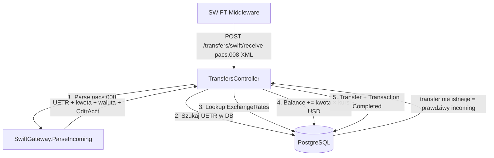
```mermaid
flowchart TD
    MW[SWIFT Middleware] -->|POST /transfers/swift/receive pacs.008 XML| RCV[TransfersController]
    RCV -->|1. Parse pacs.008| PRS[SwiftGateway.ParseIncoming]
    PRS -->|UETR + kwota + waluta + CdtrAcct| RCV
    RCV -->|2. Szukaj UETR w DB| DB[(PostgreSQL)]
    DB -->|transfer nie istnieje = prawdziwy incoming| RCV
    RCV -->|3. Lookup ExchangeRates| DB
    RCV -->|4. Balance += kwota × kurs USD| DB
    RCV -->|5. Transfer + Transaction Completed| DB
```

**Znane ograniczenia:**
- Brak callbacku potwierdzającego faktyczne dotarcie środków — po przyjęciu przez middleware transfer przechodzi w `Pending` do momentu wywołania `/receive`. W środowisku mock webhook przychodzi automatycznie po ~kilku sekundach (`Swift:TimeoutSeconds` w `payment-config.json`).
- Kursy walut są statyczne (tabela `ExchangeRates` seedowana przy starcie) — brak integracji z zewnętrznym źródłem kursów.

### Karty płatnicze

Integracja z zewnętrznym systemem **Karty-Platnicze-Aplikacje-Biznesowe** (payment-gateway + card-provider).

**Typy kart:**
- **Debit** — podpięta do konta bankowego, brak własnego salda. Rejestrowana jako `VIRTUAL` w payment-gateway, auto-aktywuje się w ciągu ~60s.
- **Prepaid** — ma własne saldo w payment-gateway. Po rejestracji bank automatycznie przeprowadza kartę przez lifecycle (`REQUESTED → PRODUCING → SHIPPED → ACTIVE`) i kartę można od razu doładować (topup).

**Przepływ płatności:**
1. Klient przykłada kartę do terminala POS
2. POS wywołuje autoryzację w payment-gateway → `APPROVED` / `DECLINED`
3. Card-provider po max 30s (dev) / 24h (prod) wysyła settlement `POST /capture` do banku
4. Bank zapisuje transakcję w historii konta

**Ograniczenia:**
- Jedno aktywne konto może mieć max 1 aktywną kartę debitową i 1 aktywną prepaid
- Konto junior może mieć wyłącznie kartę prepaid (max 1 aktywna)
- Zablokowana karta może zostać odblokowana dopiero po 24h od zablokowania
- Topup dostępny tylko dla kart prepaid w statusie `active`

### BLIK (integracja KLIK)

Integracja z systemem **KLIK** (akademicki klon BLIK). Bank działa jako klient API KLIK
i wystawia webhook do odbioru autoryzacji płatności.

#### C2B — płatność kodem

Klient generuje 6-cyfrowy kod BLIK w aplikacji banku i pokazuje go kasjerowi lub terminalowi.
KLIK zarządza kodem i przesyła autoryzację do banku przez webhook.

**Flow:**
1. Klient klika „Generuj kod" → bank wywołuje `POST /api/v1/codes/generate` w KLIK → kod ważny 120s
2. Klient pokazuje kod kasjerowi / terminalowi
3. Terminal wywołuje inicjację w KLIK → KLIK wysyła webhook `POST /klik/webhook/authorize` do banku
4. Bank natychmiast odpowiada `{received: true}` i pokazuje użytkownikowi modal z kwotą i sprzedawcą
5. Użytkownik zatwierdza lub odrzuca → bank wywołuje `POST /api/v1/payments/confirm` w KLIK i obciąża konto (ACCEPTED) lub odrzuca (REJECTED)

Rozliczenie międzybankowe (fee: 1% KLIK + 0.5% terminal) przeprowadza KLIK — bank obciąża wyłącznie konto klienta.

#### P2P — przelew na numer telefonu

Klient rejestruje numer telefonu jako alias swojego konta w systemie KLIK. Inni użytkownicy (z dowolnego banku zintegrowanego z KLIK) mogą wtedy przelać pieniądze, podając tylko numer telefonu odbiorcy.

**Flow:**
1. Klient rejestruje alias: `POST /accounts/{id}/phone-alias` → bank rejestruje alias w KLIK
2. Nadawca inicjuje przelew: `POST /transfers/p2p` z numerem telefonu odbiorcy
3. Bank sprawdza alias w KLIK (`GET /api/v1/aliases/lookup/{phone}`)
4. Jeśli odbiorca jest w tym samym banku (routing number match) → przelew wewnętrzny (natychmiastowy)
5. Jeśli odbiorca jest w innym banku → przelew zewnętrzny przez FedNow z rezerwacją salda

#### P2P off-us — odbiorca w innym banku

Gdy lookup aliasu w KLIK (`GET /api/v1/aliases/lookup/{phone}`) zwraca routing number innego banku niż nasz, przelew jest realizowany asynchronicznie przez kanał FedNow:

1. Bank rezerwuje saldo na koncie nadawcy
2. Buduje komunikat pacs.008 z danymi odbiorcy z KLIK i wysyła go do FedSystems MQ
3. Transfer otrzymuje status `Pending`
4. FedNowPollingService odpytuje MQ o pacs.002 od banku odbiorcy
5. pacs.002 ACCP → status `Completed`, saldo finalnie obciążone
6. pacs.002 RJCT → status `Rejected`, rezerwacja zwolniona

**Wymagania:**
- Aktywna integracja FedNow (patrz sekcja [FedNow](#fednow-rtgs-via-fedsystems))
- `p2p_enabled=True` dla naszego banku w panelu administracyjnym KLIK
- Klucz API KLIK skonfigurowany w `docker-compose.override.yml` jako `Integrations__KlikApiKey`

#### Ograniczenia funkcji BLIK
- Konto junior nie ma dostępu do BLIK ani do P2P
- Jedno aktywne konto może mieć max 1 aktywny alias telefoniczny
- Numer telefonu w formacie E.164 dla strefy US (`+1` + 10 cyfr, np. `+15551234567`)

#### Znane ograniczenia

P2P off-us (FedNow) został zweryfikowany end-to-end na żywo z drugim bankiem (Leek Bank,
RTN 010101012) zarejestrowanym w instancji KLIK. Scenariusz obejmował lookup aliasu, routing
pacs.008 przez FedSystems, dostarczenie do MQ drugiego banku oraz pacs.002 ACCP z powrotem.

#### Konfiguracja KLIK

```env
INTEGRATIONS_BLIK_URL=http://localhost:6006      # dev: mock; prod: URL instancji KLIK
INTEGRATIONS_KLIK_API_KEY=your_klik_api_key      # klucz API od operatora KLIK
KLIK_WEBHOOK_SECRET=changeme_klik_webhook_secret  # nagłówek X-Webhook-Secret na /klik/webhook/*
```

W środowisku deweloperskim mock KLIK (port 6006) startuje automatycznie przez docker compose
i obsługuje zarówno C2B (kod → webhook → confirm) jak i P2P (aliasy telefoniczne).

### Konto junior

Konto powiązane z kontem rodzica dla dzieci w wieku 7–13 lat.

- Każda transakcja inicjowana przez juniora trafia do statusu `pending_approval` i wymaga zatwierdzenia przez rodzica
- Rodzic widzi listę oczekujących transakcji i może je zatwierdzić lub odrzucić
- Junior może mieć jedną kartę prepaid z limitem dziennym i miesięcznym ustawianym przez rodzica
- Topup karty juniora wykonuje rodzic
 
---

## Diagramy

### Model domenowy (UML Class Diagram)

> 📝 TODO (US-52) — diagram klas: User, Account, JuniorAccount, Transaction, Transfer, Card, BlikCode
> Narzędzie: Mermaid lub draw.io

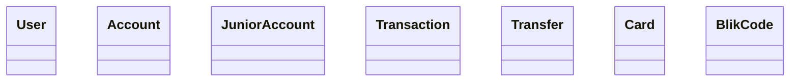
```mermaid
%% TODO (US-52): Uzupełnić diagram modelu domenowego
classDiagram
    class User
    class Account
    class JuniorAccount
    class Transaction
    class Transfer
    class Card
    class BlikCode
```

### Przepływ przelewu ACH (BPMN)

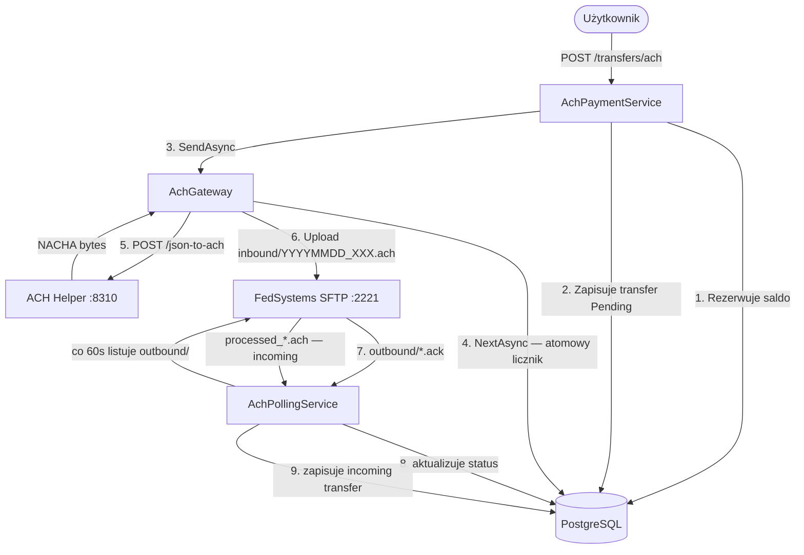
```mermaid
flowchart TD
    U([Użytkownik]) -->|POST /transfers/ach| API[AchPaymentService]
    API -->|1. Rezerwuje saldo| DB[(PostgreSQL)]
    API -->|2. Zapisuje transfer Pending| DB
    API -->|3. SendAsync| GW[AchGateway]
    GW -->|4. NextAsync — atomowy licznik| DB
    GW -->|5. POST /json-to-ach| HELPER[ACH Helper :8310]
    HELPER -->|NACHA bytes| GW
    GW -->|6. Upload inbound/YYYYMMDD_XXX.ach| SFTP[FedSystems SFTP :2221]
    SFTP -->|7. outbound/*.ack| POLL[AchPollingService]
    POLL -->|co 60s listuje outbound/| SFTP
    POLL -->|8. aktualizuje status| DB
    SFTP -->|processed_*.ach — incoming| POLL
    POLL -->|9. zapisuje incoming transfer| DB
```

**Legenda kroków:**
1. `AchPaymentService` blokuje saldo na koncie nadawcy (`ReservedBalance += amount`)
2. Transfer zapisywany z `Status = Pending`, `ExternalReferenceId = ComputeFileId(transferId)`
3. `AchGateway.SendAsync` wywoływany synchronicznie w tym samym flow
4. Atomowy counter w tabeli `AchDailyCounters` (PostgreSQL `INSERT ... ON CONFLICT DO UPDATE RETURNING`)
5. JSON z detalami przelewu wysyłany do lokalnego serwisu pomocniczego, który zwraca gotowe bajty NACHA
6. Plik NACHA uploadowany do FedSystems przez SFTP (SSH public-key auth)
7. Po przetworzeniu FedSystems umieszcza `.ack` w `outbound/` — polling sprawdza co 60s
8. Status transferu aktualizowany do `Completed` lub `Failed`, saldo debitowane lub zwalniane
9. Przelewy przychodzące (`processed_*.ach`) → nowe transakcje na koncie odbiorcy

### Przepływ przelewu FedNow (BPMN)

**Przelew wychodzący:**


```mermaid
flowchart TD
    U([Użytkownik]) -->|POST /transfers/fednow| SVC[FedNowPaymentService]
    SVC -->|1. Walidacja + rezerwacja salda| DB[(PostgreSQL)]
    SVC -->|2. Transfer status Pending| DB
    SVC -->|3. Budowa pacs.008 XML| B[Pacs008Builder]
    B --> MQ[FedNow MQ Gateway]
    MQ -->|4. POST /send| FS[FedSystems MQ :8770]
    FS -->|5. pacs.002 ACCP/RJCT| POLL[FedNowPollingService]
    POLL -->|co 1s GET /FIFO/out| FS
    POLL -->|6. Aktualizacja statusu| DB
```

**Przelew przychodzący (pacs.008 od innego banku):**

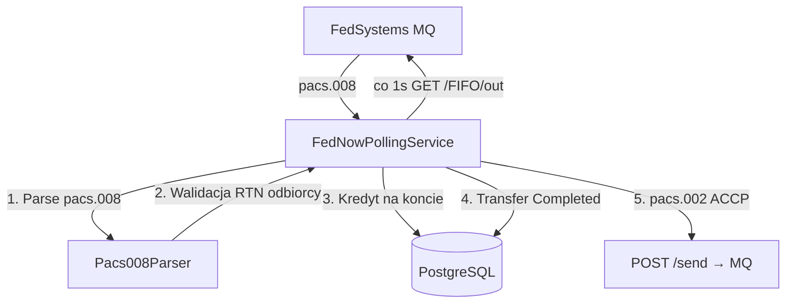
```mermaid
flowchart TD
    FS[FedSystems MQ] -->|pacs.008| POLL[FedNowPollingService]
    POLL -->|co 1s GET /FIFO/out| FS
    POLL -->|1. Parse pacs.008| P[Pacs008Parser]
    P -->|2. Walidacja RTN odbiorcy| POLL
    POLL -->|3. Kredyt na koncie| DB[(PostgreSQL)]
    POLL -->|4. Transfer Completed| DB
    POLL -->|5. pacs.002 ACCP| MQ[POST /send → MQ]
```

**Request-to-pay (pain.013 od KLIK):**

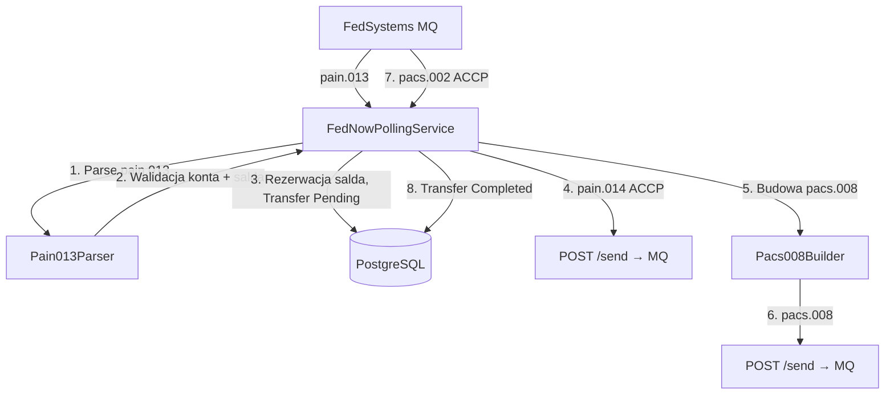
```mermaid
flowchart TD
    FS[FedSystems MQ] -->|pain.013| POLL[FedNowPollingService]
    POLL -->|1. Parse pain.013| P[Pain013Parser]
    P -->|2. Walidacja konta + salda| POLL
    POLL -->|3. Rezerwacja salda, Transfer Pending| DB[(PostgreSQL)]
    POLL -->|4. pain.014 ACCP| MQ1[POST /send → MQ]
    POLL -->|5. Budowa pacs.008| B[Pacs008Builder]
    B -->|6. pacs.008| MQ2[POST /send → MQ]
    FS -->|7. pacs.002 ACCP| POLL
    POLL -->|8. Transfer Completed| DB
```

### Przepływ KLIK C2B (BPMN)

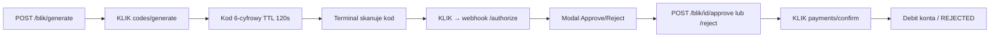
```mermaid
flowchart LR
    A[POST /blik/generate] --> B[KLIK codes/generate]
    B --> C[Kod 6-cyfrowy TTL 120s]
    C --> D[Terminal skanuje kod]
    D --> E[KLIK → webhook /authorize]
    E --> F[Modal Approve/Reject]
    F --> G["POST /blik/id/approve lub /reject"]
    G --> H[KLIK payments/confirm]
    H --> I[Debit konta / REJECTED]
```

### Przepływ przelewu RTP (BPMN)

**Przelew wychodzący:**


```mermaid
flowchart TD
    U([Użytkownik]) -->|POST /transfers/rtp| SVC[RtpPaymentService]
    SVC -->|1. Walidacja + rezerwacja salda| DB[(PostgreSQL)]
    SVC -->|2. Transfer status Pending| DB
    SVC -->|3. Budowa pacs.008 XML| B[Pacs008Builder]
    B --> GW[RtpTchGateway]
    GW -->|4. POST /transfers X-Api-Key| TCH[TCHSystems :8200]
    TCH -->|5. pacs.002 w kolejce| POLL[RtpPollingService]
    POLL -->|co 2s GET /queue/incoming| TCH
    POLL -->|6. Aktualizacja statusu| DB
```

**Legenda kroków:**
1. `RtpPaymentService` blokuje saldo na koncie nadawcy (`ReservedBalance += amount`)
2. Transfer zapisywany z `Status = Pending`, `ExternalReferenceId = E2E-{TransferId}`
3. `Pacs008Builder.Build()` tworzy komunikat ISO 20022 — `CdtrAgt/nm` ustawione na `ToBankCode` (identyfikator banku, nie RTN)
4. XML wysyłany do TCHSystems z uwierzytelnieniem `X-Api-Key` w nagłówku
5. TCH zwraca pacs.002 do kolejki przychodzących — polling co 2 sekundy
6. Status transferu aktualizowany: ACCP → `Completed` (saldo obciążone), RJCT → `Rejected` (rezerwacja zwolniona)

**Przelew przychodzący (pacs.008 od innego banku):**

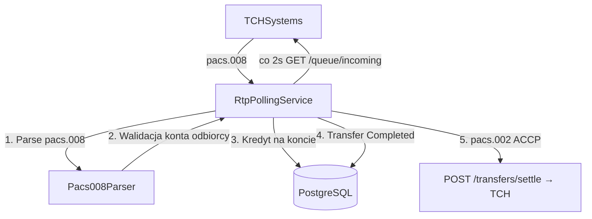
```mermaid
flowchart TD
    TCH[TCHSystems] -->|pacs.008| POLL[RtpPollingService]
    POLL -->|co 2s GET /queue/incoming| TCH
    POLL -->|1. Parse pacs.008| P[Pacs008Parser]
    P -->|2. Walidacja konta odbiorcy| POLL
    POLL -->|3. Kredyt na koncie| DB[(PostgreSQL)]
    POLL -->|4. Transfer Completed| DB
    POLL -->|5. pacs.002 ACCP| GW[POST /transfers/settle → TCH]
```

**Legenda kroków:**
1. `Pacs008Parser.Parse()` wyciąga dane nadawcy, odbiorcy, kwotę, walutę i `EndToEndId`
2. Sprawdzenie duplikatu (`EndToEndId`), walidacja istnienia konta odbiorcy i statusu `active`
3. Saldo konta odbiorcy zwiększone o kwotę przelewu
4. Transfer zapisany z `Status = Completed`, transakcja typu `Credit` dodana do historii
5. `Pacs002Builder.Build()` tworzy odpowiedź ACCP (lub RJCT jeśli konto nie istnieje) i wysyła przez `POST /transfers/settle`

### Przepływ karty płatniczej (BPMN)

**Wydanie karty i płatność (debit):**

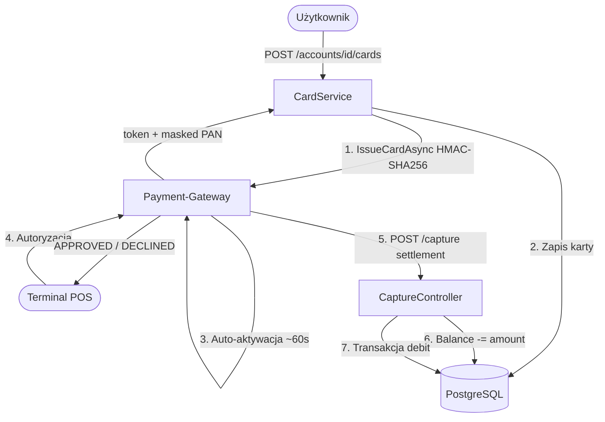
```mermaid
flowchart TD
    U([Użytkownik]) -->|POST /accounts/id/cards| SVC[CardService]
    SVC -->|1. IssueCardAsync HMAC-SHA256| GW[Payment-Gateway]
    GW -->|token + masked PAN| SVC
    SVC -->|2. Zapis karty| DB[(PostgreSQL)]
    GW -->|3. Auto-aktywacja ~60s| GW
    POS([Terminal POS]) -->|4. Autoryzacja| GW
    GW -->|APPROVED / DECLINED| POS
    GW -->|5. POST /capture settlement| CAPT[CaptureController]
    CAPT -->|6. Balance -= amount| DB
    CAPT -->|7. Transakcja debit| DB
```

**Legenda kroków:**
1. `CardsGateway.IssueCardAsync()` — karta rejestrowana jako `VIRTUAL` w payment-gateway, żądanie podpisane HMAC-SHA256
2. Token karty (`tok_...`), zamaskowany PAN i data ważności zapisane w bazie
3. Karta debitowa aktywuje się automatycznie w payment-gateway w ciągu ~60 sekund
4. Terminal POS autoryzuje płatność bezpośrednio w payment-gateway — bank nie uczestniczy w autoryzacji
5. Card-provider wysyła settlement webhook `POST /capture` po max 30s (dev) / 24h (prod)
6. **Karta debit:** saldo konta bankowego pomniejszone o kwotę transakcji (`Account.Balance -= amount`)
7. Transakcja typu `debit` ze statusem `completed` zapisana w historii konta

**Płatność kartą prepaid — różnica:**

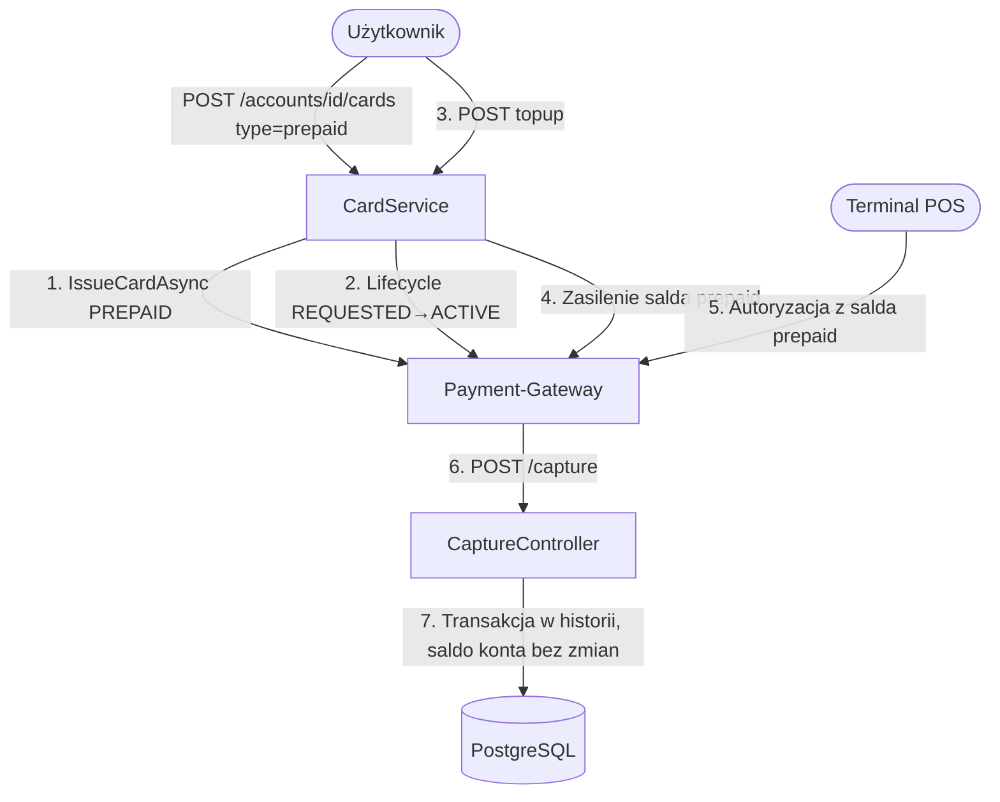
```mermaid
flowchart TD
    U([Użytkownik]) -->|POST /accounts/id/cards type=prepaid| SVC[CardService]
    SVC -->|1. IssueCardAsync PREPAID| GW[Payment-Gateway]
    SVC -->|2. Lifecycle REQUESTED→ACTIVE| GW
    U -->|3. POST topup| SVC
    SVC -->|4. Zasilenie salda prepaid| GW
    POS([Terminal POS]) -->|5. Autoryzacja z salda prepaid| GW
    GW -->|6. POST /capture| CAPT[CaptureController]
    CAPT -->|7. Transakcja w historii, saldo konta bez zmian| DB[(PostgreSQL)]
```

**Legenda kroków:**
1. Karta rejestrowana jako `PREPAID` w payment-gateway — saldo początkowe 0
2. `ActivatePrepaidInBackgroundAsync` przeprowadza kartę przez lifecycle: `REQUESTED → PRODUCING → SHIPPED → ACTIVE`
3. Rodzic (lub właściciel) zasila kartę prepaid przez `POST /accounts/{id}/cards/{cardId}/topup`
4. Środki trafiają na saldo karty w payment-gateway (nie na konto bankowe)
5. Autoryzacja płatności sprawdza saldo prepaid w payment-gateway — konto bankowe nie jest obciążane
6. Settlement webhook `POST /capture` po autoryzacji
7. **Karta prepaid:** transakcja zapisana w historii konta, ale `Account.Balance` **nie jest zmniejszane** — środki zostały już odjęte z salda prepaid w momencie autoryzacji

### Przepływ BLIK P2P on-us (BPMN)

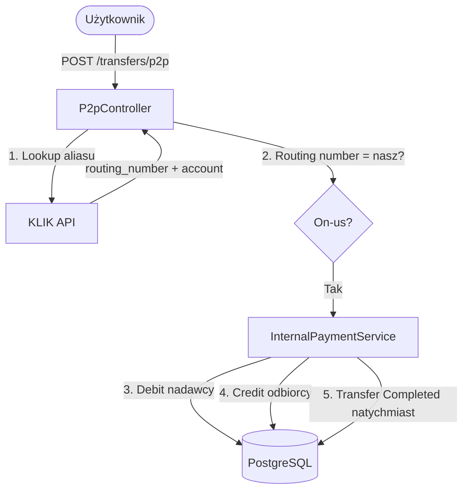
```mermaid
flowchart TD
    U([Użytkownik]) -->|POST /transfers/p2p| P2P[P2pController]
    P2P -->|1. Lookup aliasu| KLIK[KLIK API]
    KLIK -->|routing_number + account| P2P
    P2P -->|2. Routing number = nasz?| DEC{On-us?}
    DEC -->|Tak| INT[InternalPaymentService]
    INT -->|3. Debit nadawcy| DB[(PostgreSQL)]
    INT -->|4. Credit odbiorcy| DB
    INT -->|5. Transfer Completed natychmiast| DB
```

**Legenda kroków:**
1. `KlikP2pClient.LookupAliasAsync(phone)` — odpytanie KLIK o routing number i numer konta przypisany do numeru telefonu
2. Porównanie `lookup.RoutingNumber` z własnym RTN banku — jeśli się zgadza, przelew wewnętrzny
3. Saldo konta nadawcy pomniejszone o kwotę (`Balance -= amount`)
4. Saldo konta odbiorcy zwiększone o kwotę (`Balance += amount`)
5. Transfer zapisany ze statusem `Completed`, transakcje debit/credit dodane do historii — całość natychmiastowa

### Przepływ BLIK P2P off-us przez FedNow (BPMN)

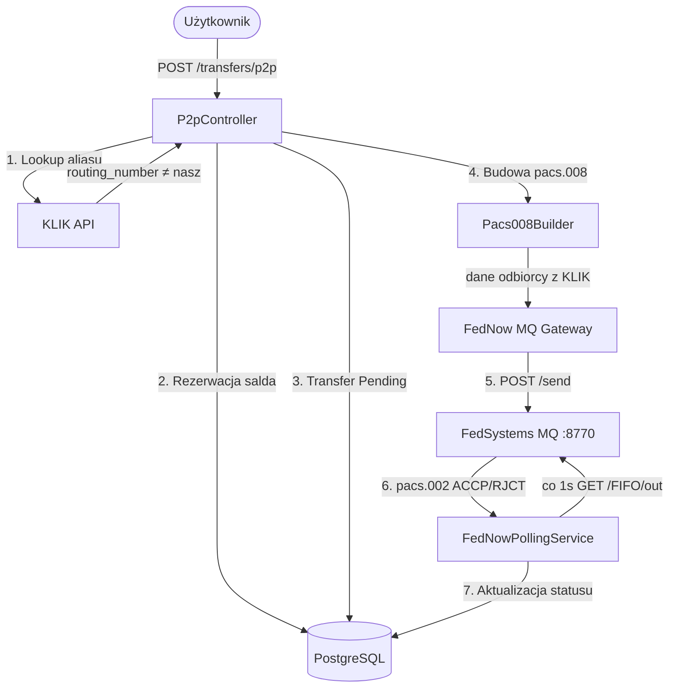
```mermaid
flowchart TD
    U([Użytkownik]) -->|POST /transfers/p2p| P2P[P2pController]
    P2P -->|1. Lookup aliasu| KLIK[KLIK API]
    KLIK -->|routing_number ≠ nasz| P2P
    P2P -->|2. Rezerwacja salda| DB[(PostgreSQL)]
    P2P -->|3. Transfer Pending| DB
    P2P -->|4. Budowa pacs.008| B[Pacs008Builder]
    B -->|dane odbiorcy z KLIK| MQ[FedNow MQ Gateway]
    MQ -->|5. POST /send| FS[FedSystems MQ :8770]
    FS -->|6. pacs.002 ACCP/RJCT| POLL[FedNowPollingService]
    POLL -->|co 1s GET /FIFO/out| FS
    POLL -->|7. Aktualizacja statusu| DB
```

**Legenda kroków:**
1. `KlikP2pClient.LookupAliasAsync(phone)` — KLIK zwraca routing number i numer konta odbiorcy w innym banku
2. Saldo nadawcy zablokowane (`ReservedBalance += amount`)
3. Transfer zapisany ze statusem `Pending`
4. `Pacs008Builder.Build()` — komunikat ISO 20022 z danymi z lookupu KLIK: `CreditorBankRtn` = routing number, `CreditorAccountNumber` = numer konta. `CreditorBankName` ustawiane jako `"Unknown Bank"` (KLIK nie zwraca nazwy banku — brak lookupa RTN→nazwa, analogicznie jak w FedNow)
5. Komunikat wysłany do FedSystems MQ — FedSystems doręcza go do banku odbiorcy
6. Bank odbiorcy przetwarza przelew i odsyła pacs.002 (ACCP = przyjęty, RJCT = odrzucony)
7. ACCP → `Completed`, saldo finalnie obciążone; RJCT → `Rejected`, rezerwacja zwolniona

### Przepływ zatwierdzania transakcji junior (BPMN)

> 📝 TODO (US-54) — diagram przepływu: transakcja pending → powiadomienie rodzica → approve/reject

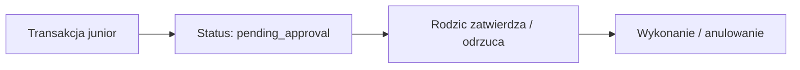
```mermaid
%% TODO (US-54): Uzupełnić diagram BPMN zatwierdzania transakcji junior
flowchart LR
    A[Transakcja junior] --> B[Status: pending_approval]
    B --> C[Rodzic zatwierdza / odrzuca]
    C --> D[Wykonanie / anulowanie]
```
 
---

## Konfiguracja sesji płatności

Plik `src/UsBankSystem.Api/payment-config.json` zawiera **parametry operacyjne** (timeouty, okna batch). Tożsamość banku (BankRtn, BankCode, BankLegalName) konfigurowana jest **wyłącznie przez zmienne środowiskowe** — domyślne wartości w kodzie C# (`PaymentSessionConfig.cs`) to `040104018` / `baguette-bank`.

```json
{
  "PaymentSessions": {
    "Ach": {
      "BatchWindowMinutes": 1,
      "CutoffHour": 23
    },
    "FedNow": {
      "TimeoutSeconds": 30,
      "PollIntervalSeconds": 1
    },
    "Rtp": {
      "TimeoutSeconds": 10
    },
    "Swift": {
      "TimeoutSeconds": 30
    }
  }
}
```

Wartości produkcyjne:
- ACH batch window: ~2-3h, cutoff: 17:00 ET
- FedNow timeout: 20s
- RTP timeout: 10s
- SWIFT: 1-5 dni roboczych
---

## Uruchomienie

### Wymagania

| System | Narzędzia |
|---|---|
| **macOS** | [Docker Desktop](https://www.docker.com/products/docker-desktop/) lub [Colima](https://github.com/abiosoft/colima) + Docker CLI + Compose plugin, [Git](https://git-scm.com/) |
| **Windows** | [Docker Desktop](https://www.docker.com/products/docker-desktop/), [Git for Windows](https://gitforwindows.org/) (zawiera Git Bash) |
| **Linux** | Docker Engine + [Compose plugin](https://docs.docker.com/compose/install/linux/), Git |

> **Windows:** Skrypty `.sh` (testy, verify-*) wymagają **Git Bash** lub **WSL2**. PowerShell nie obsługuje `source .env`. Projekt zawiera `.gitattributes` wymuszający LF w skryptach — `git clone` automatycznie zachowa poprawne zakończenia linii.

### Krok 1 — Klonowanie repo

```bash
git clone https://github.com/g0rzki/us-bank-system.git
cd us-bank-system
```

### Krok 2 — Konfiguracja zmiennych środowiskowych

```bash
cp .env.example .env          # macOS / Linux / Git Bash
# copy .env.example .env      # Windows CMD
```

Plik `.env.example` zawiera komentarze przy każdej zmiennej, pogrupowane sekcjami. Minimalne zmiany do uruchomienia:

```env
POSTGRES_PASSWORD=twoje_haslo          # dowolne — baza lokalna
JWT_SECRET=min_32_znaki_dowolny_ciag   # dowolny ciąg min. 32 znaków
```

Reszta ma sensowne domyślne wartości deweloperskie. Pełny opis zmiennych — patrz `.env.example`.

> `FRONTEND_PORT` kontroluje zarówno port frontendu w Docker jak i CORS w API — ustaw raz, działa wszędzie.

> Plik `.env` jest wykluczony z gita — nie commituj go.

### Krok 3 — Konfiguracja Ridera (opcjonalne)

Tylko jeśli uruchamiasz API bezpośrednio z IDE (bez Dockera):

```bash
cp src/UsBankSystem.Api/Properties/launchSettings.template.json src/UsBankSystem.Api/Properties/launchSettings.json
```

Uzupełnij wartości w profilu `http` danymi z `.env`:

```json
"ConnectionStrings__Default": "Host=localhost;Port=5999;Database=usbank;Username=POSTGRES_USER;Password=POSTGRES_PASSWORD",
"Jwt__Secret": "JWT_SECRET"
```

> Plik `launchSettings.json` jest wykluczony z gita.

### Krok 4 — Uruchomienie

```bash
docker compose up --build
```

Pierwsze uruchomienie pobiera obrazy i buduje kontenery — może potrwać kilka minut. Migracje bazy danych aplikują się automatycznie przy starcie.

> Mock gateway (ACH/RTP/FedNow/KLIK) startuje automatycznie jako osobny serwis.

**Force rebuild** (po zmianach w Dockerfile lub zależnościach):

```bash
docker compose build --no-cache && docker compose up
```

#### Serwisy dostępne po uruchomieniu

| Serwis | URL | Wymaga systemu siostrzanego? |
|---|---|---|
| Frontend | http://localhost:3100 | — |
| API | http://localhost:5100 | — |
| Swagger UI | http://localhost:5100/swagger | — |
| Health check | http://localhost:5100/health | — |
| Mock RTP | http://localhost:6002 | — |
| Mock FedNow | http://localhost:6003 | — |
| Mock KLIK C2B+P2P | http://localhost:6006 | — |

#### Serwisy wymagające uruchomienia projektów siostrzanych

| Serwis | URL z hosta | Projekt |
|---|---|---|
| ACH Helper (json-to-ach) | http://localhost:8310 | `payment-settlement-systems/FedSystems` |
| FedSystems SFTP | localhost:2221 | `payment-settlement-systems/FedSystems` |
| FedNow MQ | http://localhost:8770 | `payment-settlement-systems/FedSystems` |
| FedNow Central | http://localhost:8514 | `payment-settlement-systems/FedSystems` |
| TCHSystems RTP | http://localhost:8200 | `payment-settlement-systems/TCHSystems` |
| SWIFT Middleware | http://localhost:3000 | SWIFT Middleware (osobna grupa) |
| Payment Gateway (karty) | http://localhost:8072 | `Karty-Platnicze-Aplikacje-Biznesowe` |
| KLIK (real) | http://localhost:8000 | `KLIK-payments` |

> Jeśli uruchamiasz razem z projektem **Karty-Platnicze-Aplikacje-Biznesowe**, po każdym `docker compose up` w us-bank-system musisz podłączyć kontener banku do sieci payment-gatewaya:
>
> ```bash
> docker network connect cards-backend us-bank-a
> ```
>
> Bez tego card-provider nie może wysłać callbacku `/capture` do banku i transakcje kartowe nie pojawią się w historii konta. Patrz sekcja [Integracja z Karty-Platnicze](#integracja-z-karty-platnicze).

### Zatrzymanie aplikacji

```bash
docker compose down
```

Aby usunąć również dane z bazy (wolumen PostgreSQL):

```bash
docker compose down -v
```

---

## Struktura projektu

```
us-bank-system/
├── src/
│   ├── UsBankSystem.Api/             # ASP.NET Core Web API
│   │   └── payment-config.json       # konfiguracja sesji płatności (timeouty, okna batch)
│   ├── UsBankSystem.Core/            # Domain entities, interfaces
│   ├── UsBankSystem.Infrastructure/  # EF Core, repositories
│   ├── UsBankSystem.MockGateways/    # Mock stuby ACH/RTP/FedNow/SWIFT/KLIK (porty 6001-6004, 6006)
│   ├── UsBankSystem.Tests/           # Testy API
│   └── UsBankSystem.MockGateways.Tests/ # Testy mock stubów
├── frontend/                         # React + Vite SPA
├── docker-compose.yaml
├── .env.example
└── README.md
```

---

## API

Pełna dokumentacja dostępna przez Swagger UI pod `/swagger` po uruchomieniu aplikacji.

### Auth

| Metoda | Endpoint | Opis |
|---|---|---|
| POST | /auth/register | Rejestracja użytkownika |
| POST | /auth/login | Logowanie, zwraca JWT (ważny 1h) |

### Konta

| Metoda | Endpoint | Opis |
|---|---|---|
| POST | /accounts | Tworzenie konta checking/savings |
| GET | /accounts | Lista kont zalogowanego użytkownika |
| GET | /accounts/{id} | Dane konta |
| GET | /accounts/{id}/balance | Saldo |
| GET | /accounts/{id}/transactions | Historia transakcji (paginacja: `?page=1&pageSize=20`) |
| POST | /accounts/junior | Tworzenie konta junior |
| GET | /accounts/{id}/junior-accounts | Lista kont junior podpiętych do konta rodzica |
| POST | /accounts/junior/{id}/card | Dodanie karty prepaid do konta junior (tylko rodzic) |
| PATCH | /accounts/{id}/junior-limit | Zmiana limitu karty prepaid juniora (tylko rodzic) |

### Przelewy

| Metoda | Endpoint | Opis |
|---|---|---|
| POST | /transfers/internal | Przelew wewnętrzny (natychmiastowy) |
| POST | /transfers/ach | Przelew ACH (T+1, batch) |
| POST | /transfers/rtp | Przelew RTP (real-time) |
| POST | /transfers/fednow | Przelew FedNow (RTGS) |
| POST | /transfers/swift | Przelew SWIFT (międzynarodowy) |
| GET | /transfers | Lista przelewów użytkownika |
| GET | /transfers/{id}/status | Status przelewu |
| GET | /transfers/pending-approval | Przelewy juniora czekające na zatwierdzenie |
| POST | /transfers/{id}/approve | Zatwierdzenie przelewu juniora przez rodzica |
| POST | /transfers/{id}/reject | Odrzucenie przelewu juniora przez rodzica |
| POST | /transfers/{id}/webhook | Webhook od mock gateway (zmiana statusu przelewu) |

### Karty

| Metoda | Endpoint | Opis |
|---|---|---|
| GET | /accounts/{id}/cards | Lista kart konta |
| POST | /accounts/{id}/cards | Rejestracja karty (`type: "debit"` lub `"prepaid"`) |
| GET | /accounts/{id}/cards/{cardId} | Szczegóły karty (synchronizuje status z payment-gateway) |
| PATCH | /accounts/{id}/cards/{cardId}/status | Zmiana statusu (`blocked` / `active`) |
| PATCH | /accounts/{id}/cards/{cardId}/limits | Ustawienie limitów dziennego/miesięcznego |
| POST | /accounts/{id}/cards/{cardId}/topup | Doładowanie karty prepaid |
| GET | /accounts/{id}/cards/{cardId}/external-status | Status karty w payment-gateway (saldo, limity) |
| POST | /capture | Webhook od card-provider po settlement transakcji kartowej |

### BLIK

| Metoda | Endpoint | Opis |
|---|---|---|
| POST | /blik/generate | Generowanie kodu BLIK (wywołuje KLIK API) |
| GET | /blik/pending | Lista oczekujących autoryzacji BLIK |
| POST | /blik/{id}/approve | Zatwierdź autoryzację (debit konta, potwierdź KLIK) |
| POST | /blik/{id}/reject | Odrzuć autoryzację BLIK |
| GET | /blik/transactions | Historia autoryzacji BLIK |
| POST | /klik/webhook/authorize | Webhook przychodzący z KLIK (autoryzacja płatności) |
| POST | /klik/webhook/ping | Webhook ping od KLIK (keepalive) |

### P2P (przelew na numer telefonu)

| Metoda | Endpoint | Opis |
|---|---|---|
| GET | /accounts/{id}/phone-alias | Odczyt aktywnego aliasu telefon→konto |
| POST | /accounts/{id}/phone-alias | Rejestracja aliasu telefonu w KLIK |
| DELETE | /accounts/{id}/phone-alias | Usunięcie aliasu |
| POST | /transfers/p2p | Przelew na numer telefonu (on-us lub przez FedNow) |

---

## Integracje zewnętrzne

Projekt integruje się z modułami tworzonymi przez inne grupy. Adresy konfigurowane przez zmienne środowiskowe w `.env` (pełna lista z komentarzami — patrz `.env.example`):

```
INTEGRATIONS_RTP_TCH_URL=http://host.docker.internal:8200   # TCHSystems RTP
INTEGRATIONS_FEDNOW_MQ_URL=http://host.docker.internal:8770 # FedSystems MQ
INTEGRATIONS_SWIFT_URL=http://host.docker.internal:3000      # SWIFT Middleware (real, nie mock 6004)
INTEGRATIONS_CARDS_URL=http://cards_gateway_app:8000          # Karty-Platnicze w sieci Docker
INTEGRATIONS_BLIK_URL=http://web:8000                         # KLIK w sieci Docker (mock: http://mock-gateways:6006)
INTEGRATIONS_KLIK_API_KEY=twoj_api_key                        # klucz API od operatora KLIK
KLIK_WEBHOOK_SECRET=opcjonalny_sekret                         # nagłówek X-Webhook-Secret na /klik/webhook/*
```

**mock stub** (`UsBankSystem.MockGateways`):

| Kanał | Port | Zachowanie |
|---|---|---|
| ACH helper | 8310 | Konwertuje JSON z detalami przelewu → plik NACHA (`POST /json-to-ach`). Wymagany lokalnie. |
| FedSystems SFTP | 2221 | Prawdziwy serwer SFTP — upload w `inbound/`, polling `outbound/` co 60s |
| RTP | 6002 | Mock: czeka kilka sekund i odpowiada synchronicznie `Completed` |
| FedNow | 6003 | Mock: tak samo jak RTP |
| SWIFT (legacy mock) | 6004 | Mock: odpowiada natychmiast, webhook po dłuższym czasie. **Real SWIFT Middleware działa na porcie 3000.** |
| KLIK C2B+P2P | 6006 | Mock KLIK: kody C2B (TTL 120s), symulacja terminala (`POST /simulate/initiate`), potwierdzenia z fee 1%+0.5%, aliasy P2P (register/lookup/delete) |

Czasy opóźnień dla mock stubów (RTP/FedNow/SWIFT) są brane z `payment-config.json`.

#### Testowanie KLIK C2B z mockiem

```bash
# 1. Zaloguj się i zapisz token
TOKEN=$(curl -s -X POST http://localhost:5100/auth/login \
  -H "Content-Type: application/json" \
  -d '{"email":"john.doe@example.com","password":"Test123!"}' \
  | python3 -c "import sys,json; print(json.load(sys.stdin)['token'])")

# 2. Wygeneruj kod BLIK (zastąp accountId ID konta z /accounts)
curl -s -X POST http://localhost:5100/blik/generate \
  -H "Authorization: Bearer $TOKEN" \
  -H "Content-Type: application/json" \
  -d '{"accountId":"aaaa1111-1111-1111-1111-111111111111"}'
# → {"code":"123456","expiresAt":"...","expiresIn":119}

# 3. Zasymuluj terminal — wpisz kod z poprzedniego kroku
INIT=$(curl -s -X POST http://localhost:6006/simulate/initiate \
  -H "Content-Type: application/json" \
  -d '{"code":"123456","amount":25.00,"currency":"USD","merchant_name":"Coffee Corner","is_on_us":false}')
echo $INIT
# → {"transaction_id":"...","status":"pending"}

# 4. Sprawdź oczekującą autoryzację
curl -s http://localhost:5100/blik/pending -H "Authorization: Bearer $TOKEN"

# 5. Zatwierdź (zastąp {authId} ID z kroku 4)
curl -s -X POST http://localhost:5100/blik/{authId}/approve \
  -H "Authorization: Bearer $TOKEN"
# → {"status":"accepted","localTransactionId":"..."}

# 6. Sprawdź status w KLIK (zastąp {txId} z INIT.transaction_id)
curl -s http://localhost:6006/api/v1/payments/status/{txId}
# → {"status":"COMPLETED","klik_fee":0.25,"agent_fee":0.125,"merchant_net":24.625}
```

#### Testowanie KLIK P2P z mockiem

```bash
# 1. Zarejestruj alias telefonu na koncie (numer w formacie US E.164)
curl -s -X POST http://localhost:5100/accounts/{accountId}/phone-alias \
  -H "Authorization: Bearer $TOKEN" \
  -H "Content-Type: application/json" \
  -d '{"phoneNumber":"+15551234567"}'
# → {"aliasId":"...","phone":"+15551234567","registeredAt":"..."}

# 2. Sprawdź zarejestrowany alias
curl -s http://localhost:5100/accounts/{accountId}/phone-alias \
  -H "Authorization: Bearer $TOKEN"

# 3. Przelew P2P na numer telefonu (on-us — odbiorca ma konto w tym samym banku)
curl -s -X POST http://localhost:5100/transfers/p2p \
  -H "Authorization: Bearer $TOKEN" \
  -H "Content-Type: application/json" \
  -d '{"fromAccountId":"{accountId}","phone":"+15551234567","amount":10.00,"currency":"USD","description":"test P2P"}'

# 4. Usuń alias
curl -s -X DELETE http://localhost:5100/accounts/{accountId}/phone-alias \
  -H "Authorization: Bearer $TOKEN"
```

Żeby przełączyć się z mocka na prawdziwy moduł — zmień odpowiedni URL w `.env` na adres modułu innej grupy, np.:

```env
INTEGRATIONS_RTP_URL=http://adres-modulu-rtp
```

---

## Integracja z Karty-Platnicze

Projekt integruje się z **Karty-Platnicze-Aplikacje-Biznesowe** — zewnętrznym systemem obsługi kart płatniczych składającym się z payment-gateway i card-providera.

### Wymagania

Projekt **Karty-Platnicze-Aplikacje-Biznesowe** musi być uruchomiony przed startem us-bank-system. Sklonuj i uruchom go według jego własnej dokumentacji.

Po uruchomieniu dostępny jest pod:

| Serwis | URL |
|---|---|
| Payment-gateway API | http://localhost:8072 |
| Payment-gateway docs | http://localhost:8072/docs |
| POS emulator (UI) | http://localhost:8072/pos |
| Admin panel | http://localhost:3072 |

### Konfiguracja sieci Docker

Kontenery us-bank-system i Karty-Platnicze działają w osobnych sieciach. Żeby card-provider mógł wysyłać settlement (`/capture`) do banku, po każdym uruchomieniu us-bank-system wykonaj:

```bash
docker network connect cards-backend us-bank-a
```

Bez tego płatności kartowe będą zatwierdzane przez POS, ale **nie pojawią się w historii transakcji konta**.

### Klucze API

W `.env` projektu us-bank-system skonfigurowane są klucze do komunikacji z payment-gateway:

```env
CARDS_API_KEY=bank-key-us-a          # klucz banku do wystawiania i blokowania kart
CARDS_HMAC_SECRET=secret-us-a-hmac   # sekret do podpisywania żądań HMAC-SHA256
CARDS_ADMIN_KEY=admin-secret-key-2026 # klucz admina (lifecycle prepaid, full-pan w testach)
```

### Jak wykonać płatność kartą (testowo)

1. Zaloguj się do frontendu i zarejestruj kartę (debit lub prepaid)
2. Dla prepaid: poczekaj ~6s na aktywację, następnie doładuj kartę przyciskiem "Top up card" w szczegółach karty
3. Skopiuj "Payment token" z szczegółów karty
4. Pobierz pełne dane karty (numer, CVV, data ważności):
   ```bash
   curl http://localhost:8072/api/v1/cards/<TOKEN>/full-pan \
     -H "X-Admin-Key: admin-secret-key-2026"
   ```
5. Wejdź na http://localhost:8072/pos i wpisz dane karty, lub użyj curl:
   ```bash
   curl -X POST http://localhost:8072/api/v1/payments/authorize \
     -H "Content-Type: application/json" \
     -d '{"card_number":"<PAN>","expiry_month":<M>,"expiry_year":<YY>,"cvv":"<CVV>","amount":50.00,"currency":"USD"}'
   ```
6. Po ~30 sekundach transakcja pojawi się w historii konta (settlement przez `POST /capture`)

### Przepływ techniczny

```
Frontend → POST /accounts/{id}/cards          # rejestracja karty
         ← externalCardToken (tok_...)        # token do dalszej komunikacji z gateway

POST /api/v1/payments/authorize (POS)         # autoryzacja płatności przez terminal
         → APPROVED / DECLINED

card-provider (po ~30s) → POST /capture       # settlement do banku
         → transakcja zapisana w DB           # widoczna w historii konta
```

---

## Testy

Projekt zawiera skrypty do testowania przepływu end-to-end przez curl.

### Happy path — pełny przepływ

```bash
bash test-flow.sh
```

Skrypt wykonuje: rejestrację użytkownika → login → utworzenie konta → rejestrację karty debitowej i prepaid → topup prepaid → płatność przez POS → zablokowanie karty debitowej. Na końcu wypisuje tokeny kart.

### Edge cases

```bash
bash test-edge-cases.sh
```

Pokrywa 25 przypadków brzegowych:

| Kategoria | Przykłady |
|---|---|
| Auth | Duplikat emaila, złe hasło, nieistniejący użytkownik |
| Karty | Duplikat aktywnej karty, nieprawidłowy typ, monthly < daily |
| Autoryzacja | Dostęp do cudzego konta → 403 |
| Block/unblock | Cooldown 24h po zablokowaniu, próba ustawienia statusu `expired` |
| Topup | Topup karty debitowej → 400, kwota ujemna/zerowa → 400 |
| Limity | Puste body → 400, monthly < daily → 400 |
| Capture webhook | Nieznany token → 200 SETTLED, kwota ujemna → 400 |
| POS | Zablokowana karta → DECLINED, zły CVV → DECLINED, błędny PAN (Luhn) → 422 |
| No-auth | Brak tokenu JWT → 401 |

### Skrypty weryfikacyjne integracji

Pięć skryptów do weryfikacji łączności z systemami partnerskimi. Każdy wymaga `.env` z odpowiednimi sekretami. Bezpieczne do wielokrotnego uruchamiania.

| Skrypt | Co sprawdza | System partnerski | Uwagi |
|---|---|---|---|
| `verify-cards-integration.sh` | Łączność z payment-gateway, podpis HMAC, sieć Docker, webhook `/capture` | Karty-Platnicze (Filip) | Przy pierwszym uruchomieniu tworzy testową kartę prepaid (kolejne: idempotentne 409) |
| `verify-ach-integration.sh` | Łączność SFTP z FedSystems, wymiana plików, helper ACH | FedSystems ACH (VanillaMile) | Read-only — nie tworzy przelewów |
| `verify-fednow-integration.sh` | Łączność z MQ FedSystems, rejestracja banku w FedNow Central | FedSystems FedNow (VanillaMile) | Read-only — nie wysyła komunikatów |
| `verify-rtp-integration.sh` | Łączność z TCHSystems, walidacja X-Api-Key (poprawny + celowo błędny) | TCHSystems RTP (VanillaMile) | Read-only — nie tworzy przelewów |
| `verify-blik-integration.sh` | Health check KLIK, walidacja API key, dostępność webhooka `/klik/webhook/ping` | KLIK P2P (MarshallBjorn) | Read-only — lookup z dummy phone (+00000000000 → oczekiwane 404) |

System przeszedł pełną rundę testów end-to-end łączącą wszystkie integracje w jednym scenariuszu klienta (FedNow przychodzący → karta → BLIK P2P → ACH wychodzący → weryfikacja salda).

---

## Migracje bazy danych

Projekt używa Entity Framework Core. Migracje aplikują się **automatycznie** przy starcie aplikacji (`docker compose up --build`).

### Tworzenie nowej migracji

```bash
dotnet ef migrations add NazwaMigracji -p src/UsBankSystem.Infrastructure -s src/UsBankSystem.Api
```

---

## Workflow Git

- Gałąź `main` — każda zmiana przez PR z 1 approvem drugiego członka zespołu
- Gałąź `develop` - integracje z zewnętrznymi modułami innych grup
- Feature branche: `feature/US-XX-krotki-opis`, tworzone od `main`
- Commity mergowane przez **Squash and merge**
- Nie merguj własnego PR bez review drugiej osoby

### Format commitów

```
Feat: krótki opis       # nowa funkcjonalność
Fix: krótki opis        # naprawa błędu
Docs: krótki opis       # dokumentacja
Refactor: krótki opis   # refaktor bez zmiany funkcjonalności
```

### Tworzenie feature brancha

```bash
git checkout main
git pull
git checkout -b feature/US-XX-krotki-opis
```

---

## Dokumentacja

- [Backlog — Trello](https://trello.com/b/SoYXGs0x/tablica-projektowa)
- [Swagger UI](http://localhost:5100/swagger) — po uruchomieniu aplikacji

---

## Zespół

| Osoba | Zakres                                                |
|---|-------------------------------------------------------|
| [Piotr Gorzkiewicz](https://github.com/g0rzki) | Backend core, przelewy zewnętrzne, konto junior, BLIK |
| [Jakub Siłka](https://github.com/jakub7038) | Auth, frontend, karty, SWIFT                          |
